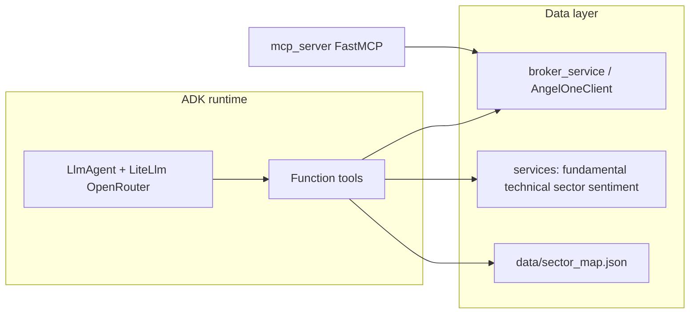

# ADK finance agent with OpenRouter, services, and broker/MCP parity

## Context from your repo

- **OpenRouter today**: `[services/ai_service.py](services/ai_service.py)` uses `AsyncOpenAI` with `OPENROUTER_BASE_URL` / key; ADK will use **LiteLLM** instead (official path per [ADK LiteLLM docs](https://google.github.io/adk-docs/agents/models/litellm/)).
- **Broker/account data today**: `[mcp_server.py](mcp_server.py)` tools call `session_manager.sessions` + `[angel_client.py](angel_client.py)` `AngelOneClient`. Logic is mixed with string formatting for MCP.
- **Research services** (already modular): `[services/fundamental_service.py](services/fundamental_service.py)` (`get_stock_fundamentals`), `[services/technical_service.py](services/technical_service.py)` (`compute_technical_indicators`), `[services/sector_service.py](services/sector_service.py)` (`get_sector_overview`, `get_market_breadth`), `[services/sentiment_service.py](services/sentiment_service.py)` (`analyze_text`, `analyze_articles`, `compute_sector_sentiment`).

You chose **full** tool surface including **trading** (place/modify/cancel). The plan still recommends documenting operational risk (irreversible orders) and optionally adding a confirmation step later.

## Architecture

- **ADK agent**: `LlmAgent` with `model=LiteLlm(model="openrouter/<provider>/<model>")` and `OPENROUTER_API_KEY` set (LiteLLM provider docs). Align default model with your app (`openai/gpt-4o-mini` → LiteLLM string typically `openrouter/openai/gpt-4o-mini`; verify against [LiteLLM OpenRouter](https://docs.litellm.ai/docs/providers/openrouter) at implementation time).
- **Modularity**: A small **generic** layer builds agents from config (name, instruction, `LiteLlm` instance, tool callables). A **finance-specific** module composes the tool list and instructions.
- **DRY broker layer**: Extract JSON-oriented helpers from `[mcp_server.py](mcp_server.py)` into a new module (e.g. `[services/broker_service.py](services/broker_service.py)` or `integrations/angel/broker_service.py`) that:
  - Accepts `AngelOneClient` (or a narrow protocol) and returns **structured `dict`** (holdings, candles list, order book, etc.).
  - Keeps MCP tools as thin wrappers: `_safe_call` + `json.dumps` / your existing `_format_*` tables where you want human-readable MCP output.
  - ADK tools return **compact dicts** (or short JSON strings if you prefer to avoid huge tool schemas); prefer dicts for fields the model can reason over.

## Proposed directory layout (new)

| Path                                                                                           | Role                                                                                                                                                                                                                                                                                                                                                                                                     |
| ---------------------------------------------------------------------------------------------- | -------------------------------------------------------------------------------------------------------------------------------------------------------------------------------------------------------------------------------------------------------------------------------------------------------------------------------------------------------------------------------------------------------- |
| `[agents/__init__.py](agents/__init__.py)`                                                     | Package marker                                                                                                                                                                                                                                                                                                                                                                                           |
| `[agents/config.py](agents/config.py)`                                                         | Env-driven settings: model id, temperature, optional feature flags                                                                                                                                                                                                                                                                                                                                       |
| `[agents/factory.py](agents/factory.py)`                                                       | Generic `build_llm_agent(name, instruction, model, tools)` — reusable for future agents                                                                                                                                                                                                                                                                                                                  |
| `[agents/finance/agent.py](agents/finance/agent.py)`                                           | `root_agent` (or `get_root_agent(...)`) for the finance use case; ADK-compatible export                                                                                                                                                                                                                                                                                                                  |
| `[agents/finance/tools_broker.py](agents/finance/tools_broker.py)`                             | Function tools bound to a **session id** via closure/factory: login is *not* re-exposed on the agent if you inject an already-authenticated session; alternatively expose `ensure_session` only in a dedicated “setup” flow — **recommended**: runner establishes `sessions.create_session(...)` then passes `session_id` into `make_finance_tools(session_id)` so secrets never appear in LLM tool args |
| `[agents/finance/tools_market.py](agents/finance/tools_market.py)`                             | Wrappers around `services.`* + `data/sector_map.json` + orchestration (e.g. technicals: fetch candles via broker helper → `compute_technical_indicators`)                                                                                                                                                                                                                                                |
| `[agents/finance/instructions.md](agents/finance/instructions.md)` (optional) or inline string | System instruction: use tools for facts, cite limitations, India/NSE context, not financial advice                                                                                                                                                                                                                                                                                                       |

**Generic pattern for other agents later**: New folder under `agents/<name>/` with its own `tools_*.py` and a thin `agent.py` that calls `factory.build_llm_agent`.

## MCP “input” — two supported interpretations

1. **Same-process parity (primary, simplest)**: After login via your existing flow, the ADK runner uses `session_manager.sessions` + `AngelOneClient` through `broker_service`. This matches MCP behavior without running a second process.
2. **True MCP client (optional, modular)**: Add `[integrations/mcp_client_bridge.py](integrations/mcp_client_bridge.py)` (or similar) that uses the Python MCP client to call the running FastMCP server’s tools when the agent runs **outside** this repo or when you only expose MCP. Define a small interface `AccountDataPort` with methods like `get_holdings()`, implemented by either `AngelOneClient` wrapper or MCP bridge. Finance tools depend on the port — **swap implementations** without changing agent instructions.

## Dependencies and security

- Add to `[requirements.txt](requirements.txt)`: `google-adk`, `litellm` (pin to a **known-safe** version per [ADK security advisory](https://github.com/google/adk-python/issues/5005) / LiteLLM’s March 2026 notice — avoid compromised `1.82.7` / `1.82.8`).
- No need to remove `[openai](requirements.txt)`; ADK path uses LiteLLM. Keep `ai_service` as-is for the web dashboard.

## Implementation sequence

1. **Extract** broker primitives from `[mcp_server.py](mcp_server.py)` into structured helpers (portfolio summary dict, raw candle fetch for `get_stock_history`, order APIs, etc.); update MCP tools to call helpers (behavior-preserving).
2. **Implement** `agents/factory.py` + OpenRouter `LiteLlm` wiring from env (`[agents/config.py](agents/config.py)`).
3. **Implement** `tools_market.py` (fundamentals, sector overview + load `[data/sector_map.json](data/sector_map.json)`, market breadth, sentiment helpers; composite tool for technicals).
4. **Implement** `tools_broker.py` with `make_broker_tools(session_id: str)` returning all tools you need, including **trading** (mirroring MCP signatures where useful). Return structured errors as dicts with `error` key.
5. **Compose** `root_agent` in `[agents/finance/agent.py](agents/finance/agent.py)` and add a **runner entrypoint** (e.g. `python -m agents.finance.run` using ADK’s `Runner` / CLI pattern from [ADK streaming quickstart](https://google.github.io/adk-docs/get-started/streaming/quickstart-streaming/) — match the exact API version you install).
6. **Optional**: `AccountDataPort` + MCP bridge module; document transport (stdio vs HTTP) in a short comment block in config, not a new README (per your preference to avoid unsolicited markdown files).

## Testing / validation

- Smoke: instantiate agent with test `session_id` after manual `sessions.create_session`, invoke one read tool and one research tool.
- Regression: run MCP server and spot-check a few tools still return the same shapes after refactor.

## Risks / notes

- **LiteLLM + OpenRouter**: occasional provider quirks (see community issues); keep model string and env vars easy to change in `[agents/config.py](agents/config.py)`.
- **Trading tools**: Strong instruction to confirm parameters with the user before calling; consider logging tool calls in the runner for audit (small, focused addition).

