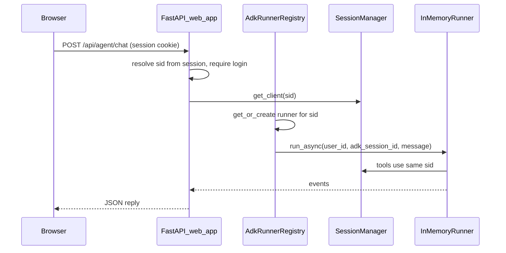

# ADK agent in MyFinance web UI

## Architecture choice

**Embed the agent in `[web_app.py](web_app.py)` / same uvicorn process as `[main.py](main.py)`** (not `adk api_server` as a second service). Reasons that match this repo:

- Broker tools in `[agents/finance/tools_broker.py](agents/finance/tools_broker.py)` close over `**session_id**` at agent build time and read `[session_manager.sessions](session_manager.py)`. Your logged-in user’s Angel client already lives there under the cookie-backed `**sid**`.
- A separate ADK HTTP server would be another process with **no** `sessions` unless you duplicate login or add a bridge—extra work for no gain in v1.

## Backend design

### 1. Runner registry module (new)

Add a focused module, e.g. `[services/adk_runner_registry.py](services/adk_runner_registry.py)` (or `integrations/adk_web_runner.py`), responsible for:

- `**get_or_create_runner(angel_session_id: str) -> InMemoryRunner**`: call `[build_finance_root_agent(angel_session_id=...)](agents/finance/agent.py)` and wrap in `InMemoryRunner` with `[FINANCE_AGENT_APP_NAME](agents/finance/agent.py)`. **Cache one runner per `sid`** (LRU cap optional later)—required because tools are bound per `sid`.
- **ADK identity**: `user_id = f"web-{sid}"` (stable, no PII in id). `**adk_session_id`**: UUID stored in **Starlette session** (e.g. `request.session["adk_session_id"]`) so multi-turn chat persists for that browser session without a DB.
- **Lazy ADK session**: on first chat for that browser session, call `runner.session_service.create_session(app_name=..., user_id=..., session_id=adk_session_id)` (same pattern as `[agents/finance/run.py](agents/finance/run.py)`).
- **Concurrency**: hold an `**asyncio.Lock` per `sid`** (or per `(user_id, adk_session_id)`) so two parallel POSTs do not interleave on the same ADK session.
- **Message loop**: build `google.genai.types.Content` from user text; `async for event in runner.run_async(...)`; **reduce events to a stable JSON payload** (final assistant text string; optionally last model message only, or append tool-call summaries—keep v1 simple: **assistant text + optional `events` flag for debug**).

### 2. HTTP API in `[web_app.py](web_app.py)`

- `**POST /api/agent/chat`** (JSON): `{ "message": "..." }`. Require login via existing `_require_login` / `sid`; return **401** if missing.
- **Config errors**: if `OPENROUTER_API_KEY` is unset, return **503** with a clear message (same expectation as `[agents/factory.py](agents/factory.py)`).
- **Optional later**: `POST /api/agent/chat/stream` (SSE) mirroring ADK’s `/run_sse`—not required for v1 if you want a smaller diff.

### 3. OpenRouter key policy (document clearly)

- ADK path uses **server env** `[OPENROUTER_API_KEY](agents/config.py)` (same as CLI). This differs from the dashboard’s **browser-stored** key for `[/api/ai/ask](web_app.py)`. The plan: **document both** in README / setup; optionally add a one-line note on the new page (“Agent uses server OpenRouter key”).

No new DB or auth system for v1: **Starlette session + in-memory ADK runner state**, aligned with your earlier decision.

## Frontend design

- **New authenticated page** e.g. `**/agent`** → `[frontend/templates/agent.html](frontend/templates/agent.html)` extending `[base.html](frontend/templates/base.html)`: simple chat transcript + input + send; show loading/error states (reuse patterns from `[dashboard.html](frontend/templates/dashboard.html)`: `fetch`, JSON POST, basic markdown-ish display).
- **Nav**: add “Agent” (or “Assistant”) link next to other logged-in routes in `[base.html](frontend/templates/base.html)`.
- **Styling**: reuse `[frontend/static/style.css](frontend/static/style.css)`; add minimal classes if needed.

## Operational constraints (call out in README)

- **Single process / few workers**: `InMemoryRunner` + `SessionManager` are **process-local**. Multiple uvicorn workers mean **split brain** unless you use sticky sessions and accept uneven cache—default `main.py` is single worker; note scaling limits.
- **Memory**: one cached runner per active `sid` holds an LLM-backed agent; cap cache size or TTL if you expect many concurrent users.

## Testing / verification

- Manual: log in → open `/agent` → ask something that triggers a **research** tool (no broker dependency) and something that needs **holdings** (broker tools).
- Optional: small async unit test mocking `run_async` if you want regression safety without live LLM.

## Files to touch (summary)

| Area                    | Files                                                                                |
| ----------------------- | ------------------------------------------------------------------------------------ |
| Runner + event handling | New `services/adk_runner_registry.py` (name flexible)                                |
| Routes                  | `[web_app.py](web_app.py)` (`/agent` GET, `/api/agent/chat` POST)                    |
| UI                      | New `frontend/templates/agent.html`, `[base.html](frontend/templates/base.html)` nav |
| Docs                    | `[README.md](README.md)` — env vars, behavior vs `/api/ai/ask`, scaling caveat       |

No changes required to `[agents/finance/agent.py](agents/finance/agent.py)` for the happy path if you always pass `**angel_session_id=sid`** from the web layer (avoids relying on `ADK_ANGEL_SESSION_ID` env for multi-user).