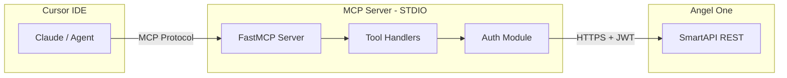

# Angel One Portfolio MCP Server

## Architecture




## Project Structure

```
MyFinanceMCP/
  .env                    # API credentials (gitignored)
  .gitignore
  requirements.txt
  server.py               # MCP server entry point
  angel_client.py         # Angel One auth + API wrapper
  .cursor/mcp.json        # Cursor MCP config
```

## Step 1: Project Setup and Dependencies

Create `requirements.txt` with:

- `smartapi-python` -- Angel One official SDK
- `pyotp` -- TOTP generation for auto-login
- `mcp` -- Model Context Protocol Python SDK
- `python-dotenv` -- Load credentials from `.env`

## Step 2: Secure Credential Storage

Create a `.env` file with all credentials:

```
ANGELONE_API_KEY=4XDUeA4C
ANGELONE_CLIENT_ID=<your_angel_one_client_id>
ANGELONE_PASSWORD=<your_trading_pin>
ANGELONE_TOTP_SECRET=FP4O3EVUYXZ5Q3WTF6I7JR772Y
```

**Critical:** The user must fill in `ANGELONE_CLIENT_ID` (Angel One login ID, e.g., "R12345678") and `ANGELONE_PASSWORD` (their 4-digit trading PIN). These were not provided and are required for authentication. The `.env` file will be added to `.gitignore`.

## Step 3: Angel One Auth + Client Wrapper (`angel_client.py`)

Build a wrapper class `AngelOneClient` that:

1. Loads credentials from environment variables via `python-dotenv`
2. Creates a `SmartConnect` instance with the API key
3. Generates a TOTP code using `pyotp.TOTP(secret).now()`
4. Calls `generateSession(client_id, password, totp)` to authenticate
5. Implements a retry loop (up to 5 attempts, 2s delay) since TOTP can expire mid-request
6. Caches the session and auto-refreshes if expired
7. Exposes clean methods: `get_profile()`, `get_holdings()`, `get_positions()`, `get_order_book()`, `get_trade_book()`, `get_funds()`, `get_ltp(symbol, exchange)`, `place_order(params)`, `modify_order(params)`, `cancel_order(order_id, variety)`

Key auth flow:

```python
from SmartApi import SmartConnect
import pyotp

obj = SmartConnect(api_key=api_key)
totp = pyotp.TOTP(totp_secret).now()
data = obj.generateSession(client_id, password, totp)
# data['data']['jwtToken'] is used for subsequent requests
```

## Step 4: MCP Server with Tools (`server.py`)

Build the MCP server using `FastMCP` from the `mcp` SDK. Register the following tools:

### Read-Only Tools (Safe)


| Tool | Description |
| ---- | ----------- |


- **get_profile** -- Returns user profile (name, email, broker ID, exchanges enabled)
- **get_holdings** -- Returns all holdings with qty, avg price, LTP, P&L, current value
- **get_positions** -- Returns open/day positions with unrealized P&L
- **get_order_book** -- Returns all orders for the day (status, type, qty, price)
- **get_trade_book** -- Returns executed trades for the day
- **get_funds** -- Returns available margin, used margin, net balance
- **get_ltp** -- Accepts symbol + exchange, returns last traded price
- **portfolio_summary** -- Aggregated view: total investment, current value, total P&L, day P&L

### Trading Tools (Require Confirmation)

- **place_order** -- Place a new order (exchange, symbol, qty, price, order_type, transaction_type)
- **modify_order** -- Modify an existing order
- **cancel_order** -- Cancel an order by ID

Example tool registration:

```python
from mcp.server.fastmcp import FastMCP

mcp = FastMCP("AngelOne Portfolio")

@mcp.tool()
def get_holdings() -> str:
    """Get all stock holdings in your Angel One demat account with current value and P&L"""
    client = get_angel_client()
    holdings = client.get_holdings()
    return format_holdings(holdings)
```

Each tool will:

1. Get/reuse the authenticated Angel One client (lazy singleton)
2. Call the appropriate SmartAPI method
3. Format the response as a readable string (with tables/summaries for Claude to interpret)
4. Handle errors gracefully with descriptive messages

## Step 5: Cursor MCP Configuration

Create `.cursor/mcp.json`:

```json
{
  "mcpServers": {
    "angelone-portfolio": {
      "command": "python",
      "args": ["server.py"],
      "cwd": "/Users/raghavswami/Desktop/MyFinanceMCP"
    }
  }
}
```

## Step 6: Testing and Verification

1. Run the MCP inspector to test tools: `npx @modelcontextprotocol/inspector python server.py`
2. Restart Cursor IDE to load the MCP server
3. Verify the server appears in Cursor Settings > Tools & MCP
4. Test with queries like "Show me my holdings" or "What is my portfolio value?"

## Questions to Resolve Before Implementation

The user **must provide** two additional credentials:

- **Angel One Client ID** (login ID like "R12345678" or similar)
- **Trading PIN/Password** (4-6 digit PIN used to log into Angel One)

Without these, the authentication will not work.