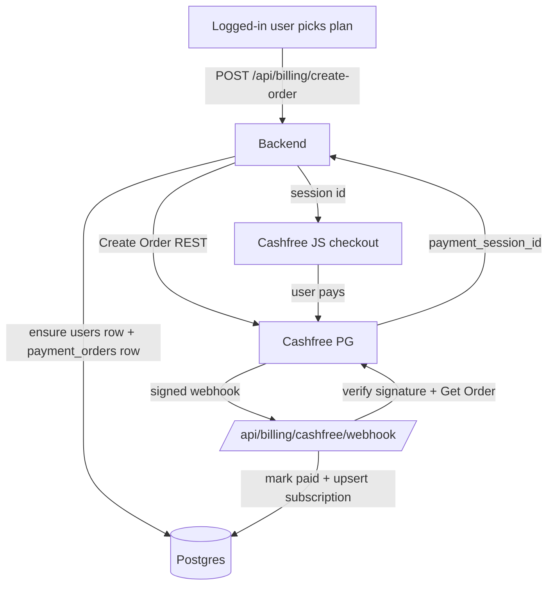

## Cashfree Payment Gateway Integration

### Core design decision
Premium today is granted the instant a `users` row has `is_active=True` (`is_premium = bool(user and user.is_active)` in [web_app.py](web_app.py) around line 527). We change premium to mean: **the user has an active, non-expired `subscription`**. The Cashfree webhook — not the browser redirect — is what creates that subscription.

Because the webhook arrives with no session and no Angel credentials in memory, we split the flow:
- **At create-order time** (user is logged in, Angel client in RAM): ensure the `users` row exists with encrypted creds (reuse existing register logic) and create a `payment_orders` row.
- **At webhook time** (no session): look up the order, verify with Cashfree, then create/extend the `subscriptions` row and set `user.is_active=True`.

### 1. Config and env vars
Add to `.env.example` and read in a new `services/billing/cashfree.py`:
- `CASHFREE_CLIENT_ID`, `CASHFREE_CLIENT_SECRET`, `CASHFREE_ENV` (`sandbox`|`production`), `CASHFREE_RETURN_URL`.
- Base URL: `https://sandbox.cashfree.com/pg` vs `https://api.cashfree.com/pg`; API version header `x-api-version: 2023-08-01`.

### 2. New DB models — [db/models.py](db/models.py)
- `Plan`: `code` (`premium_monthly`|`premium_6month`|`premium_yearly`), `label`, `price_inr`, `duration_days`, `active`.
- `PaymentOrder`: `user_id`, `plan_code`, `amount_inr`, `cashfree_order_id` (unique), `status` (`pending`|`paid`|`failed`), `cashfree_payment_id`, timestamps.
- `Subscription`: `user_id` (index), `plan_code`, `status` (`active`|`expired`), `starts_at`, `expires_at` (index), `source_order_id`.
- `PaymentEvent`: raw webhook log for idempotency (`cashfree_order_id`, `event_type`, `raw_json`, `created_at`).

### 3. Startup migration + seeding + grandfather — [db/engine.py](db/engine.py)
`init_db()` already runs additive SQL on every boot. Extend it to:
- `create_all` picks up the new tables automatically.
- Seed the three `plans` rows (₹199/30d, ₹500/180d, ₹800/365d) if missing.
- **Grandfather**: for every `users` row with `is_active=True` that has no active subscription, insert a `subscriptions` row with `expires_at = now + 365 days` so current users keep access for free.

### 4. Cashfree service — new `services/billing/cashfree.py`
Use `httpx` (already a dependency, used in [web_app.py](web_app.py)):
- `create_order(order_id, amount, customer, return_url) -> payment_session_id` (POST `/pg/orders`).
- `get_order(order_id) -> order_status` (GET `/pg/orders/{id}`) for server-side verification.
- `verify_webhook_signature(timestamp, raw_body, signature)` — HMAC-SHA256(base64) of `timestamp + raw_body` keyed with the client secret.

### 5. Billing endpoints — new `services/billing/router.py`, mounted in [web_app.py](web_app.py) next to `web.include_router(admin_router)`
- `GET /api/billing/plans` — list plans for the UI.
- `POST /api/billing/create-order` — requires a logged-in Angel session; ensures the `users` row (reuse the existing admin-proxy logic from `/api/premium/register`), creates a `payment_orders` row, calls Cashfree, returns `payment_session_id` + `order_id`.
- `POST /api/billing/cashfree/webhook` — read raw body, verify signature, dedupe via `payment_events`, call `get_order` to confirm `PAID`, mark order paid, upsert `subscriptions` with `expires_at = now + plan.duration_days`, set `user.is_active=True`.
- `GET /api/billing/status` — current subscription state (plan, expires_at) for the frontend.

### 6. Switch premium gating to subscriptions — [web_app.py](web_app.py)
- Add `has_active_subscription(user_id) -> bool` and use it inside `_registered_user_for_session`/`_premium_user` and the `is_premium` computation (line ~527) so premium = `user.is_active AND active subscription`.
- Keep the free tier (dashboard, holdings, charts) untouched. Gated: Trading Agent page, `/api/agent/*`, `/api/briefing/*`, saved conversations, risk profile persistence.
- Retire direct activation: `/api/premium/register` should no longer be the thing that unlocks premium (either fold it into create-order or keep it only for creating the `users` row).

### 7. Gate the scheduler — [services/schedular/job_executor.py](services/schedular/job_executor.py)
In `run_one`, after loading the user (near the existing `if not user.is_active` check at line 76), also skip when there is no active subscription — and disable the schedule so expired users stop receiving paid WhatsApp briefings.

### 8. Frontend — reuse the Premium Activation card in [frontend/templates/trading.html](frontend/templates/trading.html)
- Replace the single WhatsApp + `Activate` form (lines 30-44) with: three plan cards (₹199 / ₹500 / ₹800), the WhatsApp number input, and a `Pay & Activate` button.
- Update the inline handler (around line 814-840) to call `/api/billing/create-order`, then open Cashfree checkout with the returned `payment_session_id` via the Cashfree JS SDK, and show a "payment processing" state.
- When premium is active, show plan name + `expires_at` and a Renew button (existing "Premium is active" block at lines 21-28).

### 9. Admin visibility — [adminApi/router.py](adminApi/router.py)
Add read endpoints for `payment_orders` and `subscriptions` (filterable by user) so you can debug real payments; keep them behind the existing `X-Admin-Key`.

### 10. Compliance + sandbox testing
- Add Terms, Privacy, and Refund policy pages (Cashfree requires these to go live).
- Test in sandbox: success, failure, user-abandon, duplicate webhook, webhook-before-redirect, repeat purchase (extends expiry), expiry disables briefings. Then swap to production keys.

### Notes
- Keep all Cashfree secrets in env only; never commit `.env`.
- Repeat purchases should extend `expires_at` from the later of `now` or current expiry (stack remaining time).
- The `_COLUMN_MIGRATIONS` pattern in [db/engine.py](db/engine.py) is fine for now; introduce Alembic if the billing schema starts changing often.