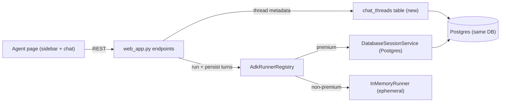

# Context-Aware Agent Chat + GPT/Claude-style History UI

## Decisions locked in
- Persistence on plain Postgres now; pgvector semantic recall deferred to Phase 2 (documented, not built).
- Both ADK agents in scope: finance (`/agent`) and trading (`/trading`), which already share `/api/agent/chat` with an `agent_type` flag.
- History is persisted for premium/registered users only (the existing `users` table). Non-premium logins keep today's ephemeral in-memory behavior.

## Current state (verified)
- `frontend/templates/agent.html` and `frontend/templates/trading.html` both POST to `/api/agent/chat`; chat session id lives in the Starlette cookie and the runner uses `InMemoryRunner`, so memory resets on restart (the UI literally says so at `agent.html` line 41).
- `services/adk_runner_registry.py` builds an `InMemoryRunner` per `(angel_sid, agent_type)` and keys ADK `user_id` to the ephemeral `web-{angel_sid}` (line 161) — that defeats cross-login persistence.
- No chat tables exist in `db/models.py`. `google-adk 1.28.0` ships `DatabaseSessionService` (confirmed importable).

## Architecture

- ADK `DatabaseSessionService` (pointed at the existing `DATABASE_URL`) becomes the source of truth for conversation turns, so agent context survives restarts automatically. It creates its own tables additively.
- A thin `chat_threads` table we own powers the sidebar (listing, titles, rename, delete). One thread maps to one ADK session via a stored `adk_session_id`.

## Backend changes

### 1. New model in [db/models.py](db/models.py)
`ChatThread`: `id`, `user_id` (FK `users.id`), `agent_type` ('finance'|'trading'), `adk_session_id` (unique), `title`, `created_at`, `updated_at`, `archived`. Export from [db/__init__.py](db/__init__.py). `init_db()` auto-creates it via `SQLModel.metadata.create_all`.

### 2. Persistence in [services/adk_runner_registry.py](services/adk_runner_registry.py)
- Create one shared `DatabaseSessionService(db_url=DATABASE_URL)` at module load.
- In `_get_or_create_runner`, build a `Runner(agent=..., app_name=..., session_service=<db service>)` when `persist=True`, else keep `InMemoryRunner`. Runners stay keyed by `angel_sid` (broker tools are bound to the sid at build time).
- Change `chat(...)` to accept a stable `user_id` and `persist` flag instead of deriving `user-web-{angel_sid}`.

### 3. New endpoints in [web_app.py](web_app.py)
- `GET /api/agent/threads?agent_type=` — list current user's threads (sidebar).
- `POST /api/agent/threads` — create a thread (new `adk_session_id`), return id.
- `GET /api/agent/threads/{id}/messages` — rebuild past messages by reading ADK session events and mapping to `{role, text}`.
- `PATCH /api/agent/threads/{id}` — rename. `DELETE /api/agent/threads/{id}` — delete thread row + ADK session.
- Update `/api/agent/chat`: accept `thread_id`; resolve premium user via existing `_registered_user_for_session`; set `user_id = f"user-{user.id}"` and `persist=True` for premium, else fall back to today's cookie/in-memory path. Auto-title the thread from the first user message and bump `updated_at`.

## Frontend changes (GPT/Claude look)

### Rework [frontend/templates/agent.html](frontend/templates/agent.html) into two panes
- Left sidebar: "New chat" button, a Finance/Trading toggle, and a scrollable conversation list (title, relative time, agent badge) with active highlight and hover rename/delete. Collapses to a drawer on mobile.
- Main pane: reuse the existing message-stream + composer JS, but load/save against `thread_id` (fetch `/threads` on load, open most recent or show the empty state; load messages via the messages endpoint; send includes `thread_id`).
- Add sidebar/layout styles to [frontend/static/style.css](frontend/static/style.css) (reuse existing `agent-*` classes where possible).

### Trading page
- [frontend/templates/trading.html](frontend/templates/trading.html) keeps its specialized widgets (risk profile, proposal cards, websockets); its chat now also creates persistent threads through the same backend. Proposal `APPROVE/REJECT` flow through `/api/agent/chat` is unchanged. Trading conversations appear in the unified sidebar with a "trading" badge.

## Phase 2 (deferred, documented only)
Enable `CREATE EXTENSION vector` in the same Postgres, add an embeddings column/table for chat messages, and inject semantically relevant past turns into the agent prompt. No code in this phase.

## Risks / notes
- `DatabaseSessionService` uses the same `postgresql+psycopg` URL; verify a clean startup once tables are created.
- Keep the non-premium ephemeral path intact so existing logins don't break.
- `/api/agent/new-chat` can be kept as a thin wrapper over the new thread-create for backward compatibility.