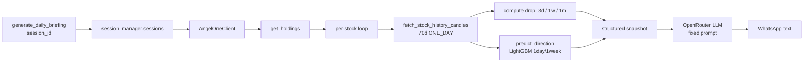

## Goal (Phase 1 only)

> "For one user, I can generate the final message."

One function. One user. Returns a `str` (WhatsApp-ready text). No scheduler, no DB, no queue, no Twilio/WhatsApp Cloud API. Those come in Phase 2+.

## Architecture



## Files to create / change

- New: [services/daily_briefing.py](services/daily_briefing.py) — the entire feature lives here for Phase 1.
- No changes to `main.py`, `mcp_server.py`, `web_app.py`, `requirements.txt` — everything we need is already installed (`openai`, `pandas`, `ta`, `lightgbm`, `joblib`, `python-dotenv`).

## What [services/daily_briefing.py](services/daily_briefing.py) contains

### 1. Per-stock snapshot builder (deterministic, no LLM)

```python
def _collect_stock_snapshot(client, symbol: str) -> dict:
    raw = fetch_stock_history_candles(client, symbol, days=70, interval="ONE_DAY")
    # raw["candles"] = [[ts, o, h, l, c, v], ...]  — uses existing services/broker_service.py
    closes = [c[4] for c in raw["candles"]]
    last = closes[-1]
    def pct(n): return round((last - closes[-n]) / closes[-n] * 100, 2)
    drops = {"3d": pct(3), "1w": pct(5), "1m": pct(22)}  # trading days
    ml = predict_direction(raw["candles"], symbol)        # existing service
    return {
        "symbol": symbol,
        "ltp": last,
        "drop_pct": drops,
        "ml": {
            "outlook": ml["overall_outlook"],
            "1day":  ml["predictions"].get("1day"),
            "1week": ml["predictions"].get("1week"),
        },
    }
```

Wraps each call in try/except so one bad symbol doesn't kill the whole briefing — failed symbols go into a `skipped` list.

### 2. Holdings selector

Reuse `holdings_for_sector_analysis(client)` from [services/broker_service.py](services/broker_service.py) — it already returns clean rows with `symbol`, `qty`, `avg_price`, `ltp`, `invested`, `current`, `pnl`, `pnl_pct`. We pass these symbols into the snapshot builder.

### 3. Fixed LLM prompt (the "particular function" you mentioned)

System prompt (full compose, LLM decides signal):

```python
SYSTEM_PROMPT = """You are a WhatsApp portfolio briefer for an Indian retail
investor on NSE. You receive a JSON snapshot of the user's holdings with, for
each stock: current price, % change vs 3 days / 1 week / 1 month ago, and
LightGBM model predictions for 1-day and 1-week direction.

Decide a signal per stock and emit a WhatsApp-ready message:
- 🟢  Good buy zone today: price has meaningfully dropped recently (typically
       at least one of 3d/1w/1m drop ≤ -3%) AND ML 1-day/1-week is not bearish.
- 🔴  Don't buy today: price has run up sharply (e.g. 3d > +3% or 1w > +5%) OR
       ML 1-day/1-week is bearish with reasonable confidence.
- 🟡  Neutral: anything in between.

Output rules:
- One short opening line: "Daily portfolio brief — <date>".
- One line per stock: "<emoji> SYMBOL ₹LTP — <one-line reason>".
- For 🟢 and 🟡 stocks, include the drop figure(s) from 3d / 1w / 1m that
  matter (e.g. "down 4.2% over 1w, 7.1% over 1m").
- For 🔴 stocks, give the reason in ≤8 words ("up 6% in 3d", "ML bearish 1w").
- Keep total under ~1500 characters (WhatsApp friendly).
- End with: "Not financial advice."
- No markdown, no code blocks, plain text only.
"""
```

User message is just `json.dumps({"as_of": ..., "holdings": [snapshot, ...], "skipped": [...]})`.

### 4. The one entry-point function

```python
async def generate_daily_briefing(
    session_id: str,
    *,
    openrouter_api_key: str | None = None,
    model: str = "openai/gpt-4o-mini",
) -> str:
    client = sessions.get_client(session_id)
    if client is None:
        raise RuntimeError("No Angel session for this id")
    rows = holdings_for_sector_analysis(client)
    snapshots, skipped = [], []
    for r in rows:
        try:
            snapshots.append(_collect_stock_snapshot(client, r["symbol"]))
        except Exception as e:
            skipped.append({"symbol": r["symbol"], "error": str(e)})
    payload = {"as_of": datetime.now().isoformat(), "holdings": snapshots, "skipped": skipped}
    api_key = openrouter_api_key or os.environ["OPENROUTER_API_KEY"]
    oai = _make_client(api_key)   # reused from services/ai_service.py
    resp = await oai.chat.completions.create(
        model=model,
        messages=[
            {"role": "system", "content": SYSTEM_PROMPT},
            {"role": "user",   "content": json.dumps(payload, default=str)},
        ],
        temperature=0.3,
        max_tokens=1200,
    )
    return resp.choices[0].message.content or ""
```

### 5. `__main__` so you can test it standalone

```python
if __name__ == "__main__":
    # mirrors agents/finance/agent.py::_bootstrap_angel_session_from_env
    load_dotenv()
    sid = "daily-briefing-default"
    sessions.create_session(
        sid,
        os.environ["ANGELONE_API_KEY"],
        os.environ["ANGELONE_CLIENT_ID"],
        os.environ["ANGELONE_PASSWORD"],
        os.environ["ANGELONE_TOTP_SECRET"],
    )
    print(asyncio.run(generate_daily_briefing(sid)))
```

Run with: `python -m services.daily_briefing`

## What this Phase 1 deliberately does NOT do

- No scheduler (APScheduler / cron).
- No WhatsApp sender (Twilio / Meta Cloud API).
- No multi-user loop, no DB, no per-user config table.
- No retry/backoff beyond per-symbol try/except.
- No caching beyond what `predict_direction` already does internally.

These are Phase 2 concerns. Once `generate_daily_briefing(session_id)` returns a clean WhatsApp string for your own account, the next phase wraps it with: "for each user in DB → call this function → send via WhatsApp API" inside one APScheduler job.

## Verification (after we implement)

1. `python -m services.daily_briefing` prints a multi-line WhatsApp-ready brief for your `.env` Angel account.
2. Output contains 🟢/🟡/🔴 for each holding and includes drop% on 🟢/🟡 lines.
3. If a symbol fails (e.g. delisted / no candles), it shows up in a "Skipped" footer instead of crashing.