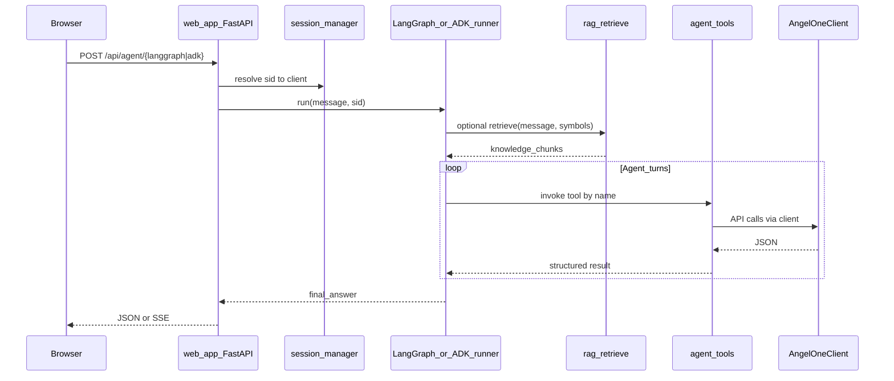

# Dual-module agents (LangGraph + Google ADK), SOLID layout, RAG vs tools

## Goals

- Two **independent** agent implementations for learning/comparison: **LangGraph** and **Google ADK**, each in its own module.
- Two **separate PRs** (recommended order below) so review stays focused.
- **SOLID**-friendly structure so `[web_app.py](web_app.py)` and broker logic do not become a god object.
- A written **RAG prerequisite / corpus plan**: what financial knowledge to teach the KB vs what must stay as **live tools** from this repo.

---

## Recommended PR order


| PR      | Scope                                                                                  | Rationale                                                                                                              |
| ------- | -------------------------------------------------------------------------------------- | ---------------------------------------------------------------------------------------------------------------------- |
| **PR1** | Shared contracts + tool façade + **LangGraph** agent + optional `/api/agent/langgraph` | Establishes `IPortfolioContext` / tool boundaries first; LangGraph is common in Python and validates the shared layer. |
| **PR2** | **Google ADK** agent module + `/api/agent/adk` + docs                                  | Reuses PR1’s shared interfaces and tool implementations; only adds ADK-specific wiring and deps.                       |


If PR1 is too large, split PR1 into **PR1a** (shared only) and **PR1b** (LangGraph)—but you asked for two PRs total, so keep PR1 as “foundation + LangGraph” unless you relax that.

---

## Target package layout (SOLID-oriented)

```text
agents/
  __init__.py
  contracts.py          # Protocols / ABCs (DIP, ISP)
  context.py            # Session-bound portfolio context adapter
  tools/
    __init__.py
    definitions.py      # Tool schemas + docstrings for LLMs
    portfolio.py        # Wrap holdings/funds/positions (uses AngelOneClient)
    market.py             # Optional: sector overview, breadth (calls existing services)
  rag/
    __init__.py
    corpus/             # Markdown sources committed to repo (curated KB)
    ingest.py           # Optional: build/update vector index (CLI or one-off)
    retrieve.py         # query -> chunks (pluggable backend)
  langgraph_runner.py   # LangGraph graph + invoke/stream
  adk_runner.py         # ADK agent + tools registration + invoke/stream
```

**How SOLID maps here**

- **S** — `tools/portfolio.py` only portfolio I/O; `rag/retrieve.py` only retrieval; runners only orchestration.
- **O** — New “framework” = new `*_runner.py` implementing the same protocol; extend tools by adding functions, not editing runners.
- **L** — Both runners satisfy one `**AgentRunner` protocol** (e.g. `async def run(message: str, session_id: str) -> str`).
- **I** — Small protocols in `[agents/contracts.py](agents/contracts.py)`, e.g. `PortfolioSnapshotBuilder`, `ToolExecutor`, `Retriever`—avoid one mega-interface.
- **D** — Runners and tools depend on `**PortfolioContext` protocol** (methods like `get_client()`, `build_snapshot()`), not on FastAPI `Request`. The adapter lives in `context.py` and is constructed in `[web_app.py](web_app.py)` using existing `[session_manager.sessions](session_manager.py)` + `[_build_portfolio_data](web_app.py)` (extract snapshot building to a shared function the web app and agents both call).

**Refactor prerequisite (small, in PR1):** Move `_build_portfolio_data` (and any shared normalization) from `[web_app.py](web_app.py)` into something like `portfolio_snapshot.py` (or `agents/tools/snapshot.py`) and import it from `web_app` so MCP/web/agents share one source of truth.

---

## Runtime workflow (both frameworks)




Both runners share: **same tool implementations**, **same snapshot builder**, **same optional RAG retrieve**; they differ only in **orchestration** (graph vs ADK).

---

## PR1 — Shared layer + LangGraph (concrete steps)

1. Add `agents/` package as above; define `AgentRunner` protocol and `PortfolioContext` in `contracts.py`.
2. Implement `context.py`: given `session_id`, return wrapper around `sessions.get_client` + call shared snapshot builder.
3. Implement **tools** that mirror what the LLM needs (start narrow): e.g. `get_portfolio_snapshot`, `get_holdings_summary`, later `get_sector_overview` (delegate to `[sector_service](sector_service.py)`), sentiment path (delegate to `[sentiment_service](sentiment_service.py)`) if rate limits allow.
4. Add **LangGraph** graph: single ReAct-style loop (tool-calling) with system prompt that states: use tools for numbers; use RAG chunks only for definitions/sector context; never invent positions.
5. Wire **FastAPI** route `POST /api/agent/langgraph` (mirror auth pattern of `[/api/ai/ask](web_app.py)`): `_require_login`, resolve `sid`, pass message body. Optional: same BYOK pattern as `ai_service` or server-side key via env (document security).
6. Add **optional** `agents/rag/corpus/*.md` stubs + `retrieve.py` no-op or simple keyword fallback in PR1; full vector store can be PR2 or follow-up.
7. Dependencies: add `langgraph`, `langchain-openai` (or provider-agnostic if you prefer) in `[requirements.txt](requirements.txt)` or `requirements-agents.txt` to keep base image smaller.

---

## PR2 — Google ADK module (concrete steps)

1. Add `google-adk` (or official package name from [ADK docs](https://google.github.io/adk-docs/get-started/)) and register **the same tool functions** as ADK tools.
2. Implement `adk_runner.py` implementing `AgentRunner`.
3. Wire `POST /api/agent/adk` with identical auth and body shape as LangGraph route for fair comparison.
4. Document env vars (e.g. `GOOGLE_API_KEY` / Vertex credentials) in README fragment.

---

## RAG: prerequisite knowledge base (what to teach)

**Purpose:** Give the model **stable financial and product semantics**, not live portfolio data.

**Corpus categories (curate as Markdown under `agents/rag/corpus/`):**


| Category                    | Examples                                                                                                                                                 | Why                                                                                                                               |
| --------------------------- | -------------------------------------------------------------------------------------------------------------------------------------------------------- | --------------------------------------------------------------------------------------------------------------------------------- |
| **Metric definitions**      | P&L %, day P&L vs MTM, concentration, beta (if you expose it)                                                                                            | Reduces hallucinated definitions                                                                                                  |
| **India market context**    | NSE/BSE, EQ suffix, circuit limits (high level)                                                                                                          | Grounds answers in your user base                                                                                                 |
| **Sector intelligence**     | You already have rich text in `[data/sector_cycles.json](data/sector_cycles.json)`—**normalize to chunked MD** with sector name as heading for retrieval | RAG-friendly; keep JSON as source of truth or sync script                                                                         |
| **Sector → symbol mapping** | Summaries derived from `[data/sector_map.json](data/sector_map.json)` (per sector bullet lists)                                                          | Helps “what sector is X?” without loading full JSON into prompt every time                                                        |
| **Product / disclaimer**    | “Not financial advice”, data freshness, what Angel API returns                                                                                           | Compliance and tone                                                                                                               |
| **How your app works**      | What “sentiment” means (FinBERT labels), what fundamentals source is                                                                                     | Aligns answers with actual `[sentiment_service](sentiment_service.py)` / `[fundamental_service](fundamental_service.py)` behavior |


**Prerequisites before “good” RAG**

- Editorial pass: **human-written or reviewed** chunks (avoid dumping raw scraped web without license/review).
- **Chunking strategy**: ~200–500 tokens, metadata tags (`sector:IT`, `type:definition`).
- **Embedding + store**: choose one (e.g. Chroma local, or Vertex AI Search later); **ingest pipeline** (`ingest.py`) that hashes corpus version so you know what was indexed.
- **Evaluation**: small set of ~20 questions (definitions + “explain my IT exposure”) with expected citations/behaviors.

**What RAG must NOT replace**

- Holdings, LTP, orders, funds, live sentiment scores → always **tools** hitting Angel + your services.

---

## What the agent should use from **this project** (tools vs RAG)


| Source                                                                                               | Use as **tool** (live / computed)                        | Use as **RAG** (static / curated)                                     |
| ---------------------------------------------------------------------------------------------------- | -------------------------------------------------------- | --------------------------------------------------------------------- |
| `[_build_portfolio_data](web_app.py)` / Angel API                                                    | Yes — snapshot, holdings, funds                          | No                                                                    |
| `[sector_service](sector_service.py)`                                                                | Yes — sector overview, breadth                           | Sector *definitions* only if duplicated in corpus for offline help    |
| `[sentiment_service](sentiment_service.py)`                                                          | Yes — run on demand (watch cost/latency)                 | Explain how sentiment is computed (doc chunk)                         |
| `[fundamental_service](fundamental_service.py)`, `[technical_service](technical_service.py)`         | Yes — per-symbol on demand                               | No                                                                    |
| `[data/sector_map.json](data/sector_map.json)`, `[data/sector_cycles.json](data/sector_cycles.json)` | Optional tool “lookup_sector(symbol)” OR embed in RAG    | Prefer RAG for narrative cycles; optional tiny tool for exact mapping |
| `[server.py](server.py)` MCP tools                                                                   | Same logic as tools façade; MCP stays separate transport | N/A                                                                   |


**Prompt rule (both runners):** “Answer with numbers only from tool outputs; use retrieved passages for definitions and sector background; if data missing, say so.”

---

## Documentation deliverables (include in both PRs)

- `docs/agents.md`: architecture diagram, env vars, how to call both endpoints, comparison checklist (latency, cost, debugging).
- `docs/rag-corpus.md`: list of corpus files, update process, what is out of scope for RAG.

---

## Risk notes

- **Dependency weight:** `torch`/`transformers` already heavy; consider optional extras for agent-only installs in Docker.
- **Rate limits:** Agent multi-tool loops multiply Angel/GNews calls—add timeouts and max steps in runners.
- **Secrets:** Prefer server-side keys for premium agent; avoid logging tool payloads with PII.

