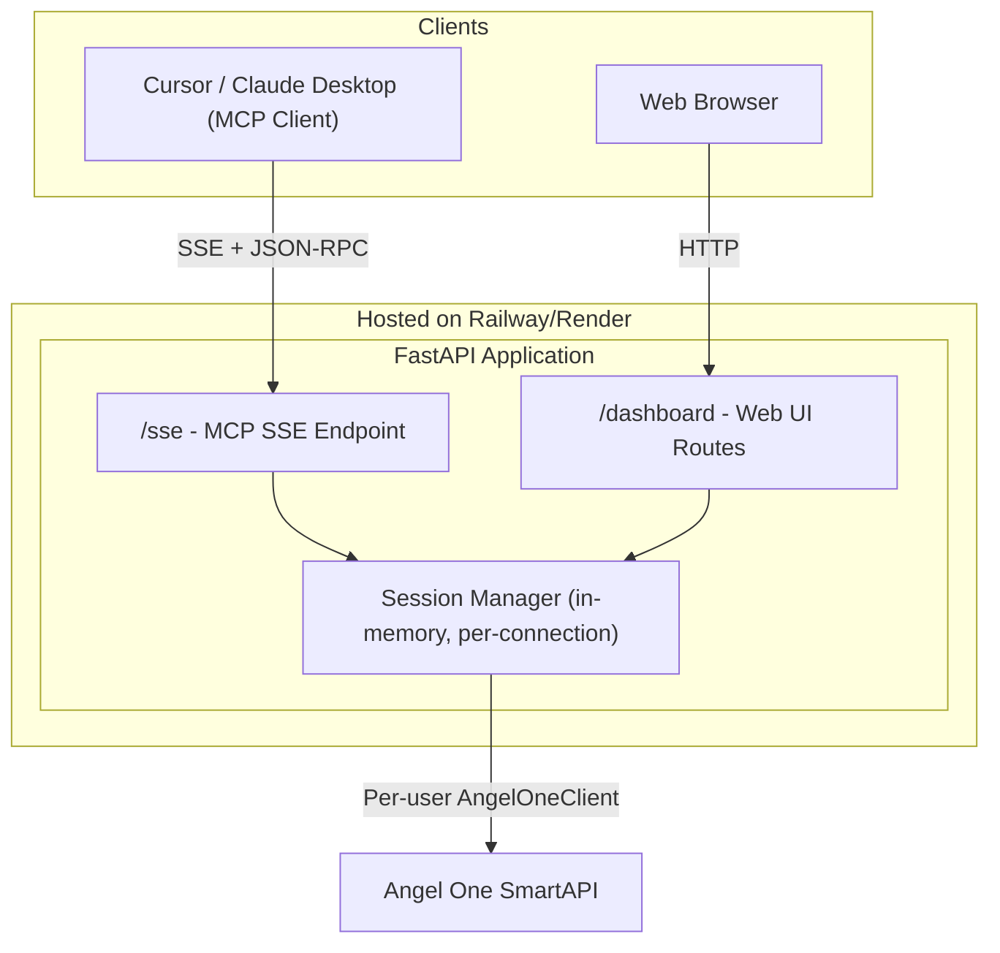

# Host MyFinanceMCP as a Public Multi-User Service

## Current State

The server runs locally via **stdio transport** with a singleton `AngelOneClient` reading credentials from a single `.env` file. This only works for one user on their own machine.

## What Needs to Change

Three major changes are required:

1. **Transport**: stdio -> SSE/Streamable HTTP (so remote clients can connect)
2. **Multi-user sessions**: Singleton client -> per-session client instances (so each user has their own Angel One connection)
3. **Web dashboard**: A simple FastAPI web app alongside the MCP server for users who want a browser-based experience

## Architecture (After)




## Hosting Platform Recommendation


|                | Railway             | Render            | Fly.io         |
| -------------- | ------------------- | ----------------- | -------------- |
| Ease           | Very easy           | Easy              | Moderate       |
| Free tier      | $5 trial credit     | Free (750 hrs/mo) | $5/mo          |
| Python support | Native              | Native            | Docker         |
| Custom domain  | Yes                 | Yes               | Yes            |
| Best for       | Quick deploy, hobby | Free start        | Global latency |


**Recommendation: Railway** -- simplest deploy experience, good for a project like this. Render is a solid free alternative.

## Detailed Implementation Steps

### Step 1: Refactor `angel_client.py` for multi-user

Remove the global singleton. Instead, `AngelOneClient.__init__` will accept credentials as parameters (not from env vars). Each user session creates its own instance.

Key change in [angel_client.py](angel_client.py):

- Remove `get_angel_client()` singleton function
- Change `AngelOneClient.__init`__ to accept `api_key`, `client_id`, `password`, `totp_secret` as arguments instead of reading from `os.environ`

### Step 2: Add session management

Create a new `session_manager.py` that maps session IDs to `AngelOneClient` instances. Since the user chose per-session credentials (no storage), sessions live only in memory and expire after 8 hours or on disconnect.

```python
class SessionManager:
    def __init__(self):
        self._sessions: dict[str, AngelOneClient] = {}

    def create_session(self, session_id, api_key, client_id, password, totp_secret):
        client = AngelOneClient(api_key, client_id, password, totp_secret)
        self._sessions[session_id] = client
        return client

    def get_client(self, session_id) -> AngelOneClient | None:
        client = self._sessions.get(session_id)
        if client:
            client.ensure_session()
        return client

    def remove_session(self, session_id):
        self._sessions.pop(session_id, None)
```

### Step 3: Refactor `server.py` for remote + multi-user

- Switch transport from stdio to **SSE**: `mcp.run(transport="sse", host="0.0.0.0", port=PORT)`
- Add a `login` tool that users must call first with their Angel One credentials. This creates their session.
- All other tools retrieve the per-session client instead of calling the singleton.

Key changes in [server.py](server.py):

- Replace `get_angel_client()` calls with session-based client lookup
- Add a `login(api_key, client_id, password, totp_secret)` MCP tool
- Change `mcp.run()` to use SSE transport with configurable port

**Note on MCP session tracking**: FastMCP with SSE transport provides a session context. We can use `mcp.get_context()` or the request context to tie each connection to a session ID automatically.

### Step 4: Build the web dashboard

Create a FastAPI web app (`web_app.py`) with:

- **Login page**: Form where users enter their Angel One credentials (API key, client ID, password, TOTP secret)
- **Dashboard page**: Shows portfolio summary, holdings table, positions, funds
- **Session cookie**: Ties browser session to their AngelOneClient instance
- Use Jinja2 templates for server-side rendered HTML (keeps it simple)

Pages:

- `GET /` -- Landing page with project description
- `GET /login` -- Credential form
- `POST /login` -- Authenticates and creates session
- `GET /dashboard` -- Portfolio overview
- `GET /holdings` -- Detailed holdings view
- `GET /positions` -- Open positions
- `POST /logout` -- Destroys session

### Step 5: Combine MCP + Web in a single app

Create a `main.py` entry point that mounts both:

- The MCP SSE server at `/mcp/` (or `/sse`)
- The web dashboard at `/`

Both share the same `SessionManager` instance.

### Step 6: Dockerize

Create a `Dockerfile`:

```dockerfile
FROM python:3.12-slim
WORKDIR /app
COPY requirements.txt .
RUN pip install --no-cache-dir -r requirements.txt
COPY . .
EXPOSE 8000
CMD ["python", "main.py"]
```

And a `.dockerignore` to exclude `.env`, `__pycache__/`, `logs/`, `.cursor/`.

### Step 7: Deploy to Railway

1. Push code to a GitHub repository
2. Connect the repo to Railway
3. Set environment variable `PORT=8000` (Railway injects `PORT` automatically)
4. Railway auto-detects the Dockerfile and deploys
5. Get a public URL like `https://myfinancemcp.up.railway.app`

### Step 8: User connection instructions

**For MCP users (Cursor/Claude Desktop):**
Users add this to their MCP client config:

```json
{
  "mcpServers": {
    "angelone-portfolio": {
      "url": "https://your-app.up.railway.app/sse"
    }
  }
}
```

Then call the `login` tool with their credentials at the start of each session.

**For web users:**
Visit `https://your-app.up.railway.app`, enter credentials in the login form, and use the dashboard.

## Security Considerations

- Credentials are never stored on disk -- they exist only in memory for the session duration
- All traffic must go over HTTPS (Railway/Render provide this by default)
- Sessions auto-expire after 8 hours (matching Angel One's session lifetime)
- Add rate limiting to prevent brute-force attacks on the login endpoint
- Add a clear disclaimer that users are entering their trading credentials

## New Files to Create

- `session_manager.py` -- Per-session client management
- `web_app.py` -- FastAPI web dashboard routes
- `main.py` -- Combined entry point (MCP + Web)
- `templates/` -- Jinja2 HTML templates (base, login, dashboard, holdings, positions)
- `static/` -- CSS for the web dashboard
- `Dockerfile` -- Container definition
- `.dockerignore` -- Files to exclude from container

## Files to Modify

- [angel_client.py](angel_client.py) -- Remove singleton, accept credentials as constructor args
- [server.py](server.py) -- SSE transport, session-based client lookup, add `login` tool
- [requirements.txt](requirements.txt) -- Add `fastapi`, `uvicorn`, `jinja2`, `python-multipart`

