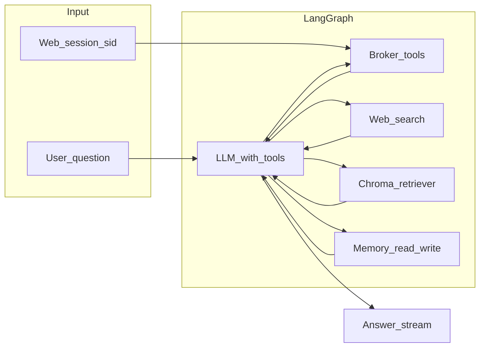

# LangGraph agent plan (Chroma, ST embeddings, web search, memory, MCP-aligned tools)

## Stack (as you specified)

| Layer                   | Choice                            | Notes                                                                                          |
| ----------------------- | --------------------------------- | ---------------------------------------------------------------------------------------------- |
| Orchestration           | **LangGraph**                     | State graph + tool-calling loop; optional checkpointing for short-term memory                  |
| RAG store               | **ChromaDB**                      | Local persistent client; collections per corpus type                                           |
| Embeddings              | **sentence-transformers**         | e.g. `all-MiniLM-L6-v2` (small, CPU-friendly); no API cost                                     |
| Web search              | **Tavily** or **SerpAPI**         | Free tier limits; abstract behind one `WebSearchTool` interface                                |
| Broker / portfolio data | **Existing MCP surface**          | Same capabilities as `[server.py](server.py)`; see “MCP vs in-process” below                   |
| Memory                  | **SQLite** (default) or **Redis** | SQLite: LangGraph `SqliteSaver` + a small `user_prefs` table; Redis if you deploy multi-worker |
| UI                      | **Existing FastAPI dashboard**    | New route + page or extend current AI panel in `[web_app.py](web_app.py)` / templates          |

---

## MCP vs in-process tools (important)

Your app mounts MCP at `[main.py](main.py)` under `/mcp` (FastMCP SSE). A LangGraph agent running **inside the same uvicorn process** already has access to `[session_manager.sessions](session_manager.py)` and the logged-in `AngelOneClient`.

- **Recommended (Phase 3):** Implement **in-process tools** that call the same primitives as MCP tools (holdings, LTP, orders, `portfolio_summary`, etc.) using `sid` from the browser session. This avoids self-HTTP, duplicate session keys, and SSE complexity.
- **Phase 1 “strengthen MCP”:** Treat as **done** for product features; optionally add **one** thin tool you know the agent will need first (e.g. normalized `get_quote` + holdings bundle) in `[server.py](server.py)` **and** mirror it in-process so MCP clients and LangGraph stay aligned.

If you strictly want the agent to “call MCP,” plan a follow-up: HTTP MCP client with a dedicated server-side session bridge—higher effort, not required for v1.

---

## Example flow (your scenario) as a LangGraph design

**User:** “Should I buy more Reliance today?”

**Planned subgraph (logical steps; the model picks tools, you constrain with prompts + edges):**

1. **Resolve context** — Load `sid` → client; reject if not logged in.
2. **Tools (broker)** — LTP / search scrip / holdings (Reliance weight, cash, funds).
3. **Web search** — Tavily/SerpAPI: “Reliance Industries news last 7 days” (+ optional RBI/global if user asks macro).
4. **RAG retrieve** — Sector note (Reliance → Energy/Oil or conglomerate chunks), your curated NSE/BSE-style docs, **user rules** from memory-backed store.
5. **Memory read** — Risk appetite, avoid-list, goals (SQLite/Redis).
6. **Synthesis node** — LLM with strict rules: cite tool numbers; label web/RAG as “general context”; disclaimer.

Implement as a **single ReAct-style graph** first (simpler than hard-coded 6-node DAG). Add **explicit nodes** later for observability (e.g. separate `retrieve_rag` node).

---

## Phase 2 — RAG layer (Chroma + sentence-transformers)

**Collections (suggested):**

| Collection             | Content                                                          | Source / ingestion                                                                                                                                                     |
| ---------------------- | ---------------------------------------------------------------- | ---------------------------------------------------------------------------------------------------------------------------------------------------------------------- |
| `sector_knowledge`     | Sector drivers, cycles                                           | Migrate `[data/sector_cycles.json](data/sector_cycles.json)` + headings from `[data/sector_map.json](data/sector_map.json)` into chunked Markdown; version in metadata |
| `product_help`         | Metric definitions, disclaimers, how sentiment/fundamentals work | New `rag/corpus/*.md`                                                                                                                                                  |
| `market_reference`     | NSE/BSE basics, order types (generic)                            | Curated, licensed or original text only                                                                                                                                |
| `user_trades_outcomes` | **Optional**                                                     | Requires **export pipeline**: Angel trade book → anonymized snippets + outcome labels (you do not have a long history DB today—plan as Phase 2b)                       |
| `user_rules`           | Investment preferences                                           | Prefer **structured memory** (SQLite) for exact rules; mirror short natural-language summaries into RAG for semantic recall                                            |
| `uploaded_pdfs`        | Analyst reports                                                  | Ingestion job: extract text, chunk, embed; store file hash in metadata                                                                                                 |

**Implementation sketch:**

- `rag/embeddings.py` — load ST model once (singleton), `embed_documents` / `embed_query`.
- `rag/chroma_store.py` — `get_client(path)`, `ingest(collection, chunks)`, `query(collection, query, k)`.
- `rag/ingest_cli.py` — `python -m rag.ingest --rebuild` to rebuild from corpus + JSON exports.
- **Dependencies:** `chromadb`, `sentence-transformers` (heavy; consider optional `requirements-langgraph.txt` or Docker stage).

**Guardrails in prompts:** RAG is **not** live prices or your live positions—always pair with broker tools.

---

## Phase 3 — LangGraph agent

- **State:** `messages`, `sid` (or internal `user_id`), optional `rag_context`, `tool_rounds` cap.
- **Tools:** bind structured tools: `get_portfolio_snapshot`, `get_ltp(symbol)`, `search_news_web(query)` (Tavily/SerpAPI), `rag_search(query, collection?)`, `memory_get` / `memory_set` (preferences only).
- **Checkpointing (short-term memory):** LangGraph `SqliteSaver` keyed by `thread_id` = web session id or explicit `conversation_id` from UI.
- **Model:** Start with OpenAI/compatible API (you already use `[ai_service.py](ai_service.py)`); keep provider swappable via env.
- **Limits:** `max_iterations`, timeouts on web search and Angel API calls.

---

## Phase 4 — Dashboard integration

- **API:** `POST /api/agent/langgraph/chat` with JSON `{ "message", "thread_id"? }` and cookie session; return JSON or **SSE** for streaming tokens.
- **UI:** New section on dashboard (or dedicated page): chat thread list, input, “sources” panel (which tools/RAG chunks were used—optional).
- **Secrets:** Tavily/SerpAPI keys server-side only in `.env`; never send to browser.

---

## Memory layer (short vs long term)

| Type       | Mechanism                                                     | Content                                                                                                     |
| ---------- | ------------------------------------------------------------- | ----------------------------------------------------------------------------------------------------------- |
| Short-term | LangGraph thread checkpoints (SQLite)                         | Recent turns, same session                                                                                  |
| Long-term  | SQLite table `user_memory` (key-value or JSON per `user_key`) | Risk appetite, goals, sectors avoid/prefer, **summaries** of past advice (not full chat unless you want it) |

**Redis:** Use if you run multiple uvicorn workers and need shared checkpoints + memory; else SQLite is enough for single-node.

---

## Prerequisites / risks

- **Legal/content:** NSE/BSE “reports,” analyst PDFs—only ingest material you have rights to use.
- **“Past trade outcomes”:** Needs defined schema and ETL from Angel trade book; label “outcome” carefully to avoid survivorship bias in advice.
- **Performance:** First load of sentence-transformers is slow; consider lazy init + warm-up on container start.
- **Free tiers:** Tavily/SerpAPI rate limits—cache search results per symbol+day where safe.

---

## Deliverables checklist

- Phase 2: Chroma path on disk (e.g. `./data/chroma/`), ingest script, minimal corpus committed.
- Phase 3: `langgraph` graph module + tool registry + checkpoint DB path env var.
- Phase 4: Dashboard chat + streaming (optional v2).
- Docs: `docs/langgraph-agent.md` — env vars, how to rebuild RAG, tool list vs MCP parity table.

