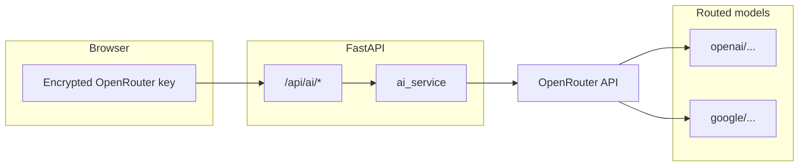

# OpenRouter migration plan

## Current state

- All LLM traffic goes through `[ai_service.py](ai_service.py)`: `AsyncOpenAI` + `chat.completions.create` for insights and Q&A.
- `[web_app.py](web_app.py)` exposes `POST /api/ai/insights` and `POST /api/ai/ask`; they read `api_key` from the JSON body and default `model` to `"gpt-4o-mini"`.
- The dashboard stores an encrypted key in the browser and sends it with each request (`[templates/dashboard.html](templates/dashboard.html)`).
- **There is no Gemini (or other) LLM SDK in this repo today**—only the `openai` package in `[requirements.txt](requirements.txt)`. “Replacing GPT + Gemini libraries” here means: **one integration path** (OpenRouter) instead of ever adding `google-generativeai` (or similar) alongside OpenAI.

## Recommended technical approach

OpenRouter exposes an **OpenAI-compatible** HTTP API. The standard pattern is to **keep the official `openai` Python SDK** and set:

- `base_url="https://openrouter.ai/api/v1"`
- `api_key=<user’s OpenRouter key>`

You do **not** need a second client library for Gemini when routing through OpenRouter; you only change the **model string** to a Gemini slug OpenRouter supports (e.g. `google/gemini-2.0-flash-001`—confirm exact IDs on [openrouter.ai](https://openrouter.ai) when implementing).

OpenRouter also recommends optional headers (`HTTP-Referer`, `X-Title`) for their rankings; pass them via `default_headers` on the client if you want that.

## Code changes (concrete)

1. `**[ai_service.py](ai_service.py)**`
  - Introduce a small helper (or module-level constants) that builds `AsyncOpenAI` with:
    - `base_url` for OpenRouter (optionally overridable via env, e.g. `OPENROUTER_BASE_URL`, default `https://openrouter.ai/api/v1`).
    - Optional `default_headers` for referer/title from env (e.g. `OPENROUTER_HTTP_REFERER`, `OPENROUTER_APP_NAME`) so production can set site URL without hardcoding.
  - Change default `model` parameter from `"gpt-4o-mini"` to an **OpenRouter-qualified** default (e.g. `"openai/gpt-4o-mini"`—pick one canonical default and document it in code comments only if needed).
  - Broaden exception handling / user messages: map `AuthenticationError` → invalid key (OpenRouter), `APIError` → generic “LLM API error” or “OpenRouter API error” so copy matches the new provider.
2. `**[web_app.py](web_app.py)`**
  - Update JSON error strings on the AI routes from “OpenAI API key” to something accurate: e.g. “OpenRouter API key” or “LLM API key”.
  - Align default `body.get("model", ...)` with the same OpenRouter default model id as `ai_service.py`.
3. **Templates and marketing copy**
  - `[templates/dashboard.html](templates/dashboard.html)`: label, placeholders, and placeholder div text (“Enter your … key”).
  - `[templates/landing.html](templates/landing.html)` and `[templates/connect.html](templates/connect.html)`: same terminology so users know they need an OpenRouter key and can paste models from OpenRouter’s catalog.
4. `**[requirements.txt](requirements.txt)`**
  - **Keep** `openai`; it remains the HTTP client for OpenRouter. No `google-generativeai` unless you later add a **direct** Gemini path (out of scope for this goal).

## Optional UX enhancement (not required for correctness)

- Add a **model dropdown** or text field on the dashboard so users can switch between OpenRouter models (GPT vs Gemini) without code changes; wire it to the existing `model` field already supported by the API.

## Verification

- With a real OpenRouter key: call `/api/ai/insights` and `/api/ai/ask` and confirm completions succeed for at least two model ids (e.g. one `openai/...`, one `google/...`) if both are in your OpenRouter account/plan.
- Confirm invalid key still returns a clear 400-style error.

## Note on “removing libraries”

You remove **provider-specific Gemini code paths** by not using Google’s SDK; you **do not** remove the `openai` package unless you rewrite raw HTTP with `httpx`—which adds work without benefit for this stack.