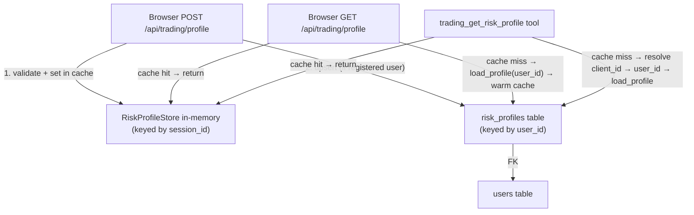

# Persist Risk Profile to DB

## Current problem

`RiskProfileStore` in [`services/risk_profile.py`](services/risk_profile.py) is a pure in-memory dict keyed by **session id**. Every server restart or session expiry wipes the profile. The trading agent's `trading_get_risk_profile` tool returns `{"error": "No risk profile set..."}` even for returning users.

## Key insight: the existing bridge

`_registered_user_for_session(client)` in [`web_app.py`](web_app.py) already looks up the Postgres `users` row for the logged-in Angel One session via `angel_client_id`. This gives us `user.id` — the stable, session-independent key to persist against.

## Data flow after the change



## Files to change

### 1. [`db/models.py`](db/models.py) — add `RiskProfile` table

New SQLModel table. `user_id` is `unique=True` (1:1 with `users`). `allowed_products` stored as a comma-separated string.

```python
class RiskProfile(SQLModel, table=True):
    __tablename__ = "risk_profiles"
    id: int | None = Field(default=None, primary_key=True)
    user_id: int = Field(foreign_key="users.id", index=True, unique=True)
    age: int
    goal: str
    horizon_years: int
    risk_tolerance: str
    tax_bracket: str
    max_single_order_value: float
    max_position_pct: float
    allowed_products: str          # "DELIVERY" or "DELIVERY,INTRADAY"
    max_daily_trades: int
    updated_at: datetime = Field(default_factory=datetime.utcnow)
```

Table creation is handled automatically by the existing `SQLModel.metadata.create_all(engine)` in `init_db()` — no migration SQL needed.

---

### 2. [`services/risk_profile.py`](services/risk_profile.py) — add DB helpers

Add two standalone functions (lazy DB imports to avoid circular deps):

- `save_profile(user_id: int, profile: ClientRiskProfile) -> None` — upsert into `risk_profiles` (SELECT → UPDATE or INSERT)
- `load_profile(user_id: int) -> ClientRiskProfile | None` — SELECT and reconstruct a `ClientRiskProfile`

The existing `RiskProfileStore` and `build_profile_from_dict` are **unchanged** — they keep working as the in-memory layer.

---

### 3. [`web_app.py`](web_app.py) — 3 targeted edits

**A. `GET /api/trading/profile` (line ~1458)**

After the cache miss (`risk_profiles.get(sid) is None`), try to load from DB and warm the cache:
```python
user = _registered_user_for_session(client)
if user:
    profile = load_profile(user.id)
    if profile:
        risk_profiles.set(sid, profile)
```

**B. `POST /api/trading/profile` (line ~1469)**

After `risk_profiles.set(sid, profile)`, also persist to DB:
```python
user = _registered_user_for_session(client)
if user:
    save_profile(user.id, profile)
```

**C. Trading page render (line ~1464)**

`ctx["has_risk_profile"]` currently only checks in-memory. Add a DB fallback so the UI shows the profile form as already filled if the user has a saved profile:
```python
if not risk_profiles.has(sid) and user:
    profile = load_profile(user.id)
    if profile:
        risk_profiles.set(sid, profile)
ctx["has_risk_profile"] = risk_profiles.has(sid)
```

---

### 4. [`agents/trading/tools.py`](agents/trading/tools.py) — DB fallback in tool

`trading_get_risk_profile` currently only checks the in-memory cache. Add a DB fallback using `client.client_id` (already accessible via `sessions.get_client(session_id)`):

```python
def trading_get_risk_profile() -> dict[str, Any]:
    profile = risk_profiles.get(session_id)
    if profile is None:
        client = _client_or_error(session_id)
        if client:
            # look up user by angel_client_id → load from DB → warm cache
            ...
    if profile is None:
        return {"error": "No risk profile set..."}
    return profile.to_dict()
```

---

## What stays the same

- `ClientRiskProfile` dataclass — unchanged
- `build_profile_from_dict` — unchanged
- `RiskProfileStore` class — unchanged
- All existing API contracts — unchanged
- Unregistered users (no `users` row) continue to use in-memory only
