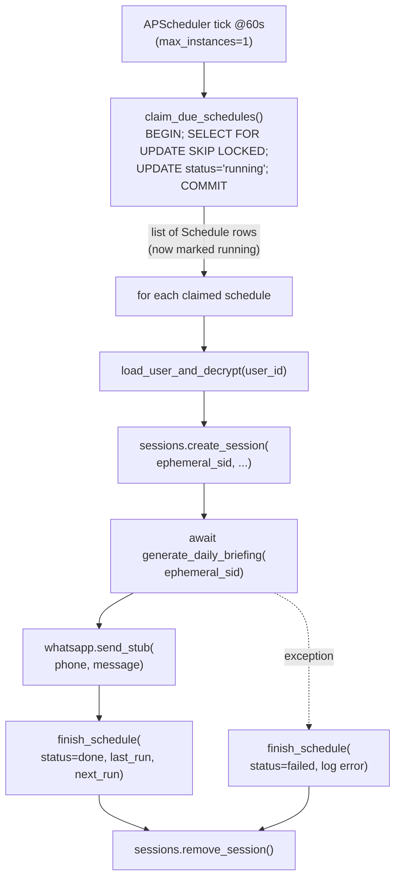

## Phase 2: Scheduler + DB Integration

### Outcome
- One `AsyncIOScheduler` started in `[main.py](main.py)` lifespan when `SCHEDULER_ENABLED=1`.
- Every 60s it runs `check_and_run_jobs()`, which DB-claims due schedules with row-level locks, runs the briefing per user with an ephemeral Angel session, sends a stub WhatsApp message, logs the result, and bumps `next_run`.
- Concurrency-safe today (Postgres `FOR UPDATE SKIP LOCKED` + per-row `status`), so we can add more workers later without code changes.

### Architecture



### Files to add

- `services/schedular/runner.py` — APScheduler boot + tick handler.
- `services/schedular/repository.py` — DB claim + finish helpers (the only place that uses `FOR UPDATE SKIP LOCKED`).
- `services/schedular/job_executor.py` — per-schedule pipeline (decrypt → session → briefing → WhatsApp → log).
- `services/schedular/whatsapp.py` — stub sender now, real provider later (single `send(phone, message)` interface).

### Files to modify

- `[db/models.py](db/models.py)` — add `Schedule.status: str` (`pending` default, indexed).
- `[db/engine.py](db/engine.py)` — add idempotent `ALTER TABLE schedules ADD COLUMN IF NOT EXISTS status VARCHAR DEFAULT 'pending'` in `init_db()` so the new column appears on existing DBs without Alembic.
- `[main.py](main.py)` — start/stop the scheduler in `_lifespan` when `SCHEDULER_ENABLED=1`.
- `[requirements.txt](requirements.txt)` — add `apscheduler`.

### 1. Schedule schema bump

Add `status` to the existing model:

```python
class Schedule(SQLModel, table=True):
    ...
    status: str = Field(default="pending", index=True)  # pending | running | done | failed
```

Lifecycle:
- `pending` — newly created or re-armed for next run.
- `running` — claimed by a tick, work in progress.
- `done` — last run succeeded; armed again the moment `next_run <= now()`.
- `failed` — last run errored; same arming behavior, just observability.

### 2. Repository — atomic claim under row-level lock

```startLine:38:38:db/engine.py
engine = create_engine(DATABASE_URL, echo=False, pool_pre_ping=True)
```

`services/schedular/repository.py` will use the shared `engine` directly so we can drop to raw SQL for the lock:

```python
CLAIM_SQL = text("""
    SELECT id, user_id, kind, interval_minutes, next_run
    FROM schedules
    WHERE enabled = true
      AND status IN ('pending', 'done', 'failed')
      AND next_run <= now()
    ORDER BY next_run
    FOR UPDATE SKIP LOCKED
    LIMIT :batch
""")

def claim_due_schedules(batch: int = 25) -> list[ClaimedSchedule]:
    with engine.begin() as conn:                          # one transaction
        rows = conn.execute(CLAIM_SQL, {"batch": batch}).all()
        if not rows:
            return []
        ids = [r.id for r in rows]
        conn.execute(
            text("UPDATE schedules SET status='running' WHERE id = ANY(:ids)"),
            {"ids": ids},
        )
        return [ClaimedSchedule(**r._mapping) for r in rows]
```

Why this is safe:
- `FOR UPDATE SKIP LOCKED` makes a second worker silently skip rows already locked in another transaction.
- We commit (`engine.begin()` exits) the moment status flips to `running`, so the lock is short and other concurrent ticks (or workers later) can claim other rows.

Companion `finish_schedule(...)` runs in its own short transaction:

```python
def finish_schedule(schedule_id: int, *, success: bool, interval_minutes: int) -> None:
    new_status = "done" if success else "failed"
    next_run = datetime.utcnow() + timedelta(minutes=interval_minutes)
    with engine.begin() as conn:
        conn.execute(
            text("""
                UPDATE schedules
                   SET status = :st, last_run = now(), next_run = :nr
                 WHERE id = :id
            """),
            {"st": new_status, "nr": next_run, "id": schedule_id},
        )
```

### 3. Job executor — addresses both flagged issues

`services/schedular/job_executor.py` does the per-row pipeline. It deliberately solves both problems called out in the request:

- **Concurrency protection** — only invoked for rows already flipped to `running` by `claim_due_schedules`; nobody else can pick them up.
- **In-memory session storage** — uses an *ephemeral* `session_id` created and torn down inside the function, so the scheduler never depends on a session left behind by some web request:

```python
async def run_one(claim: ClaimedSchedule) -> None:
    started = time.perf_counter()
    sid = f"sched-{claim.id}-{uuid4().hex[:8]}"
    try:
        with get_session() as db:
            user = db.get(User, claim.user_id)
            if not user or not user.is_active:
                raise RuntimeError(f"user {claim.user_id} missing or inactive")

            password = decrypt_value(user.angel_password_encrypted)
            totp     = decrypt_value(user.angel_totp_secret_encrypted)
            api_key, client_id, phone = (
                user.angel_api_key, user.angel_client_id, user.whatsapp_number
            )

        sessions.create_session(sid, api_key, client_id, password, totp)
        message = await generate_daily_briefing(sid)
        await whatsapp.send(phone, message)

        _log(claim, status="success",
             message=f"sent {len(message)} chars",
             duration_ms=_ms(started))
        repository.finish_schedule(claim.id, success=True,
                                   interval_minutes=claim.interval_minutes)
    except Exception as e:
        logger.exception("schedule %s failed", claim.id)
        _log(claim, status="failed", message=str(e)[:500],
             duration_ms=_ms(started))
        repository.finish_schedule(claim.id, success=False,
                                   interval_minutes=claim.interval_minutes)
    finally:
        sessions.remove_session(sid)            # never leak in-memory creds
```

Failure isolation: the `try/except` is per schedule, so one user's bad creds or a 500 from Angel can never abort the tick.

### 4. WhatsApp stub (pluggable)

`services/schedular/whatsapp.py`:

```python
async def send(phone: str | None, message: str) -> None:
    """Phase-2 stub: log only. Swap impl when a provider is chosen."""
    target = phone or "<unset>"
    preview = message.replace("\n", " ⏎ ")[:140]
    logger.info("[whatsapp-stub] to=%s | %s", target, preview)
```

The Log row in `[db/models.py](db/models.py)` already captures `status`/`message`/`duration_ms`, so an audit trail exists from day one even before a real sender lands.

### 5. APScheduler runner (single instance)

`services/schedular/runner.py`:

```python
_scheduler: AsyncIOScheduler | None = None

async def check_and_run_jobs() -> None:
    claims = repository.claim_due_schedules(batch=25)
    if not claims:
        return
    logger.info("scheduler tick: claimed %d schedules", len(claims))
    for c in claims:                       # sequential keeps Angel rate-limit friendly
        await job_executor.run_one(c)

def start() -> None:
    global _scheduler
    if _scheduler is not None:
        return
    _scheduler = AsyncIOScheduler(timezone="UTC")
    _scheduler.add_job(
        check_and_run_jobs,
        trigger=IntervalTrigger(minutes=1),
        id="check_and_run_jobs",
        max_instances=1,                   # APScheduler-level overlap guard
        coalesce=True,                     # collapse missed ticks
        misfire_grace_time=30,
    )
    _scheduler.start()

def stop() -> None: ...
```

Three layers of overlap protection: `max_instances=1` (per process), `status='running'` (per row), `FOR UPDATE SKIP LOCKED` (per cluster). Adding workers later requires no code change.

### 6. Lifespan wiring

```startLine:47:64:main.py
@asynccontextmanager
async def _lifespan(_app: Starlette):
    """Starlette 0.37+ removed on_event; use lifespan for startup/shutdown."""
    try:
        from db import init_db

        init_db()
    except Exception as e:
        logger.warning("init_db skipped: %s", e)
    task = asyncio.create_task(_cleanup_loop())
    try:
        yield
    finally:
        task.cancel()
```

Add scheduler boot guarded by env flag, so non-scheduler instances (or local dev) stay clean:

```python
if os.environ.get("SCHEDULER_ENABLED") == "1":
    from services.schedular.runner import start, stop
    start()
    try:
        yield
    finally:
        stop()
        task.cancel()
        ...
else:
    try:
        yield
    finally:
        task.cancel()
        ...
```

Operational note: run the scheduler host with `uvicorn --workers 1` (already the default in `[main.py](main.py)`); other replicas leave `SCHEDULER_ENABLED` unset.

### Out of scope (per constraints)
- No Celery, no Redis, no leader election service.
- No Alembic migrations — `init_db()` adds the new column with `ADD COLUMN IF NOT EXISTS`.
- Real WhatsApp provider deferred; stub keeps the interface stable.
