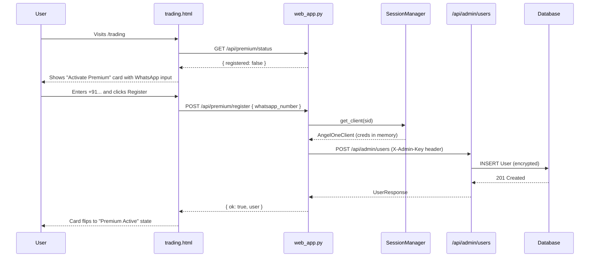

# Premium User Registration (Backend + UI)

## Summary

Let logged-in users self-register for the premium trading feature directly from the Trading page. The user only enters a WhatsApp number; the server pulls Angel One credentials from the live session and persists them via the existing admin API.

## End-to-End Flow



## 1. Backend changes

### 1a. New endpoints in [web_app.py](web_app.py)

Add near the existing `api_trading_profile_*` handlers (around line 1112):

```python
import httpx  # add near top with other imports

def _registered_user_for_session(client) -> User | None:
    """Look up a User row by the angel_client_id of the live session."""
    from db import get_session
    from db.models import User
    from sqlmodel import select
    with get_session() as s:
        return s.exec(
            select(User).where(User.angel_client_id == client.client_id)
        ).first()


@web.get("/api/premium/status")
async def api_premium_status(request: Request):
    sid = _sid(request)
    client = sessions.get_client(sid) if sid else None
    if not client:
        return JSONResponse({"error": "Not authenticated"}, status_code=401)
    user = _registered_user_for_session(client)
    if user and user.is_active:
        return JSONResponse({
            "registered": True,
            "whatsapp_number": user.whatsapp_number,
            "user_id": user.id,
        })
    return JSONResponse({"registered": False})


@web.post("/api/premium/register")
async def api_premium_register(request: Request):
    sid = _sid(request)
    client = sessions.get_client(sid) if sid else None
    if not client:
        return JSONResponse({"error": "Not authenticated"}, status_code=401)

    try:
        body = await request.json()
    except Exception:
        return JSONResponse({"error": "Invalid JSON body"}, status_code=400)
    whatsapp_number = (body.get("whatsapp_number") or "").strip()
    if not whatsapp_number.startswith("+"):
        return JSONResponse(
            {"error": "whatsapp_number must start with + and country code"},
            status_code=400,
        )

    admin_key = os.environ.get("ADMIN_API_KEY", "").strip()
    if not admin_key:
        return JSONResponse({"error": "Server misconfigured"}, status_code=500)

    base_url = str(request.base_url).rstrip("/")
    async with httpx.AsyncClient(timeout=10.0) as http:
        resp = await http.post(
            f"{base_url}/api/admin/users",
            headers={"X-Admin-Key": admin_key},
            json={
                "whatsapp_number": whatsapp_number,
                "angel_api_key": client.api_key,
                "angel_client_id": client.client_id,
                "angel_password": client.password,
                "angel_totp_secret": client.totp_secret,
            },
        )

    data = resp.json() if resp.content else {}
    if resp.status_code == 201:
        return JSONResponse({"ok": True, "user": data})
    if resp.status_code == 409:
        return JSONResponse(
            {"ok": False, "error": "You are already registered for premium."},
            status_code=409,
        )
    return JSONResponse(
        {"ok": False, "error": data.get("detail") or "Registration failed."},
        status_code=resp.status_code or 500,
    )
```

### 1b. Pass status into the trading template

In the existing `trading_page` handler (around line 429), add a context flag so the UI can render the right state on first paint:

```python
@web.get("/trading", response_class=HTMLResponse)
async def trading_page(request: Request):
    client = _require_login(request)
    if client is None:
        return RedirectResponse("/login", status_code=302)
    _ensure_adk_chat_session_id(request, _ADK_TRADING_CHAT_SESSION_KEY)
    sid = _sid(request)
    ctx = _ctx(request, "trading")
    ctx["has_risk_profile"] = risk_profiles.has(sid) if sid else False
    ctx["ws_sid"] = sid or ""
    portfolio = _get_portfolio_cached(sid, client)
    ctx["holdings_json"] = json.dumps(portfolio.get("holdings", []))

    # NEW: premium registration status
    user = _registered_user_for_session(client)
    ctx["is_premium_registered"] = bool(user and user.is_active)
    ctx["registered_whatsapp"] = user.whatsapp_number if user else ""

    return templates.TemplateResponse(request, "trading.html", ctx)
```

### 1c. Add httpx to [requirements.txt](requirements.txt)

```
httpx>=0.27.0
```

## 2. UI changes in [frontend/templates/trading.html](frontend/templates/trading.html)

Add a new section directly above the existing "Risk Profile" card (around line 16). It mirrors the same `card trading-section` pattern already used on the page, so it visually fits without any CSS additions.

```html
<!-- Premium Registration -->
<section class="card trading-section" id="premium-section">
  <h2 class="trading-section-title">Premium Activation</h2>

  
  <div class="premium-status premium-status--active" id="premium-active">
    <div>
      <p class="premium-headline">Premium is active</p>
      <p class="premium-sub">WhatsApp alerts will be sent to <strong>{{ registered_whatsapp }}</strong>.</p>
    </div>
    <span class="premium-badge">ACTIVE</span>
  </div>
  
  <div class="premium-cta" id="premium-cta">
    <p class="premium-headline">Activate the Premium Trading Agent</p>
    <p class="premium-sub">Get trade proposals and approvals delivered to WhatsApp. We use the Angel One credentials from your current session, so you only need to share a number.</p>
    <form id="premium-form" class="premium-form" novalidate>
      <label class="premium-label" for="premium-whatsapp">WhatsApp number</label>
      <div class="premium-row">
        <input type="tel" id="premium-whatsapp" name="whatsapp_number"
               placeholder="+919999999999" pattern="^\+[0-9]{8,15}$"
               required autocomplete="tel">
        <button type="submit" class="btn btn-accent" id="premium-submit">Activate</button>
      </div>
      <p class="premium-hint">Include the country code (e.g. <code>+91</code> for India).</p>
      <p class="premium-msg" id="premium-msg" role="status" aria-live="polite"></p>
    </form>
  </div>
  
</section>
```

Add these scoped styles inside the existing `<style>` block in `trading.html` (before `</style>`):

```css
/* Premium activation */
.premium-status { display: flex; justify-content: space-between; align-items: center; gap: 1rem; }
.premium-status--active .premium-headline { color: var(--green); }
.premium-badge { font-size: .7rem; font-weight: 700; letter-spacing: .08em;
  padding: .25rem .55rem; border-radius: 4px;
  color: var(--green); background: rgba(34,197,94,.12); border: 1px solid rgba(34,197,94,.3); }
.premium-headline { font-size: 1rem; font-weight: 600; margin: 0 0 .25rem 0; }
.premium-sub { font-size: .85rem; color: var(--muted); margin: 0; }
.premium-form { margin-top: .75rem; }
.premium-label { font-size: .8rem; color: var(--muted); display: block; margin-bottom: .3rem; }
.premium-row { display: flex; gap: .5rem; flex-wrap: wrap; }
.premium-row input {
  flex: 1 1 220px; min-width: 200px;
  background: var(--surface-solid); border: 1px solid var(--border); border-radius: var(--radius-sm);
  color: var(--text); padding: .5rem .7rem; font-size: .95rem; font-family: inherit;
}
.premium-row input:focus { outline: none; border-color: var(--accent); }
.premium-hint { margin: .4rem 0 0 0; font-size: .75rem; color: var(--muted); }
.premium-hint code { background: var(--surface); padding: .05rem .3rem; border-radius: 3px; }
.premium-msg { margin-top: .5rem; font-size: .85rem; min-height: 1.1em; }
.premium-msg--error { color: var(--red); }
.premium-msg--success { color: var(--green); }
```

Add this small script block at the bottom of `trading.html` (just before the closing `</script>` of the existing IIFE, or as a new self-contained `<script>` after it):

```html
<script>
(function () {
  const form = document.getElementById('premium-form');
  if (!form) return; // already registered, nothing to wire

  const $input = document.getElementById('premium-whatsapp');
  const $btn = document.getElementById('premium-submit');
  const $msg = document.getElementById('premium-msg');
  const $section = document.getElementById('premium-section');

  function setMsg(text, kind) {
    $msg.textContent = text || '';
    $msg.className = 'premium-msg' + (kind ? ' premium-msg--' + kind : '');
  }

  form.addEventListener('submit', async function (e) {
    e.preventDefault();
    const whatsapp = ($input.value || '').trim();
    if (!/^\+[0-9]{8,15}$/.test(whatsapp)) {
      setMsg('Please enter a valid number with country code, e.g. +919999999999.', 'error');
      $input.focus();
      return;
    }
    $btn.disabled = true;
    setMsg('Activating...', '');
    try {
      const res = await fetch('/api/premium/register', {
        method: 'POST',
        headers: { 'Content-Type': 'application/json' },
        body: JSON.stringify({ whatsapp_number: whatsapp }),
      });
      const data = await res.json().catch(function () { return {}; });
      if (res.ok && data.ok) {
        $section.innerHTML =
          '<h2 class="trading-section-title">Premium Activation</h2>' +
          '<div class="premium-status premium-status--active">' +
            '<div>' +
              '<p class="premium-headline">Premium is active</p>' +
              '<p class="premium-sub">WhatsApp alerts will be sent to <strong>' +
                whatsapp.replace(/[<>&]/g, '') +
              '</strong>.</p>' +
            '</div>' +
            '<span class="premium-badge">ACTIVE</span>' +
          '</div>';
      } else {
        setMsg(data.error || ('Error ' + res.status), 'error');
        $btn.disabled = false;
      }
    } catch (err) {
      setMsg('Network error: ' + err.message, 'error');
      $btn.disabled = false;
    }
  });
})();
</script>
```

## UX summary

- The Trading page now leads with a clear **Premium Activation** card.
- Unregistered users see a one-field form (WhatsApp number) with country-code hint and inline validation.
- Registered users see a green "Premium is active" state with their saved number masked-by-context.
- No reload needed — on success the card swaps to the active state in place.
- Server-rendered initial state means no flicker for already-registered users on page load.

## Key Points

- **Auth**: Both endpoints require a live broker session (`sid` + active `AngelOneClient`).
- **Creds source**: `sessions.get_client(sid)` exposes `api_key`, `client_id`, `password`, `totp_secret` — confirmed in [angel_client.py](angel_client.py) (constructor stores all four as instance attributes).
- **Admin key**: Read from `ADMIN_API_KEY` env var (already used by `check_admin_key` in [adminApi/router.py](adminApi/router.py)).
- **Idempotency**: The admin API already returns 409 on duplicate `angel_client_id`; we surface this as a friendly "already registered" message.
- **No schema changes**: Reuses the existing `User` model in [db/models.py](db/models.py) and the existing admin route.

## Out of scope (can be follow-ups)

- Editing/updating the registered WhatsApp number from the UI.
- Deactivation (cancel premium) flow.
- Surfacing premium status in the top nav or dashboard.
