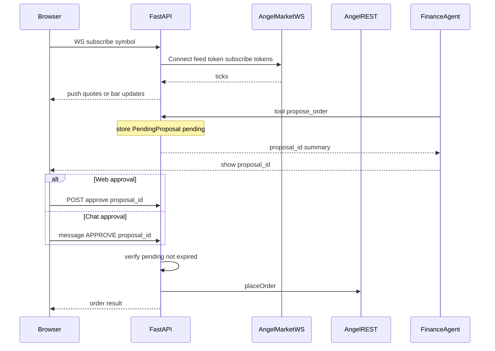

# Real-time charts and permission-gated trading

## Current baseline

- **Market data today**: Historical OHLC via [`fetch_stock_history_candles`](services/broker_service.py) / `get_candle_data`; snapshots via [`get_ltp`](angel_client.py) and [`fetch_market_depth`](services/broker_service.py) (`get_market_data`). There is **no streaming** implementation yet; [`requirements.txt`](requirements.txt) already lists `websocket-client`.
- **Orders today**: [`angel_place_order`](agents/finance/tools_broker.py) calls [`place_order_result`](services/broker_service.py) immediately. The agent prompt in [`agents/finance/agent.py`](agents/finance/agent.py) asks for verbal confirmation only—**not enforceable** in code.

## Architecture (high level)

## 1. Real-time market data

**Primary (true streaming):** Use **Angel SmartAPI Market Data WebSocket** (v2 pattern: JWT/feed token from session, subscribe by `exchange|token`, receive tick updates). Implement a small **long-lived subscriber** in the backend (e.g. new module under `services/` or methods on [`AngelOneClient`](angel_client.py)) that:

- Reuses the same login/session as today (`ensure_session` / refresh token as needed).
- Maintains one connection (or pool) and a registry of which browser clients want which symbols.
- Normalizes outbound messages to a stable shape: `{ ts, ltp, volume?, bid?, ask? }` (map from Angel payload fields).

**Push to UI:** Add a **FastAPI WebSocket** (or SSE) route that:

- Authenticates the user the same way as the rest of [`web_app.py`](web_app.py) (existing `sid` / session pattern).
- On subscribe, registers interest in `symboltoken` (resolve via existing `search_scrip` once per session).

**Chart behavior:**

- **Bootstrap**: Keep using existing candle fetch ([`fetch_stock_history_candles`](services/broker_service.py) or intraday interval if you add e.g. `ONE_MINUTE` for same day) so the chart paints immediately.
- **Live layer**: Either (a) update a **last-price** series / current candle’s close from ticks, or (b) aggregate ticks into 1m bars server-side. Start with (a) for speed; add (b) if you need proper intraday OHLC.

**Fallback:** If WebSocket feed is unavailable (subscription, network), **poll** `get_ltp` or `get_market_data` on a timer (e.g. 1–5s) and emit the same outbound shape so the frontend does not care.

**Note:** Confirm your Angel account’s **market data / API entitlements**; behavior depends on broker rules.

## 2. Starting a trade only after permission (web + chat)

**Remove “fire and forget” from the agent surface:** The LLM should **not** call a tool that hits `placeOrder` directly. Instead:

| Step | Who | What |
|------|-----|------|
| Propose | Agent via new tool | Persist a **pending proposal** (full Angel `order_params`, human summary, `created_at`, `ttl`, `status=pending`). Return `proposal_id` + text for the user. |
| Approve (web) | User | Dashboard lists pending proposals; **Approve** calls a **FastAPI route** that validates and executes. |
| Approve (chat) | User | Explicit pattern, e.g. `APPROVE <proposal_id>`; handled by **server** (message parser endpoint or dedicated tool that **only** checks server state, not model honesty). |
| Execute | Server only | Single internal function, e.g. `execute_proposal(session_id, proposal_id)`, that: loads proposal, checks `pending` + not expired + `session_id` matches, optionally checks **risk caps** (from stored client profile), then calls existing [`place_order_result`](services/broker_service.py). |

**In-chat safety:** Parsing `APPROVE ...` should happen in **trusted code** (e.g. FastAPI handler that inspects the user message before the agent runs, or a tool that requires `proposal_id` and verifies the proposal exists in the store—**do not** pass a free-text “user said yes” flag the model can forge). Optionally require the proposal summary hash or a short numeric code shown in the UI to reduce typo approvals.

**State storage:** Start with an **in-memory** dict keyed by `(session_id, proposal_id)` with TTL (aligned with your [`session_manager`](session_manager.py)); document that multi-process deploy needs Redis/DB later.

**Agent instructions:** Update [`FINANCE_INSTRUCTION`](agents/finance/agent.py) to describe: propose → wait for approval via UI or `APPROVE <id>` → never claim an order filled until execution endpoint confirms.

**MCP parity:** If [`mcp_server.py`](mcp_server.py) exposes `place_order`, apply the **same** proposal + execute pattern or restrict execution to a tool that requires a server-issued approval token.

## 3. Optional: risk appetite enforcement

Store a simple **risk profile** per browser/session (or user record): max order value, max position %, allowed products (`DELIVERY` vs `INTRADAY`). Validate in `execute_proposal` **before** `place_order_result` so approvals cannot bypass limits.

## 4. Files likely touched (implementation phase)

- New: `services/trade_proposals.py` (or similar) — CRUD + `execute_proposal`.
- New: `services/realtime_feed.py` — Angel WS + fan-out to browser WS.
- [`angel_client.py`](angel_client.py) — feed token / WS helpers if not in SmartConnect already.
- [`web_app.py`](web_app.py) — WebSocket market route; REST `GET /api/trades/pending`, `POST /api/trades/{id}/approve|reject`; chat route hook for `APPROVE` if messages go through your backend.
- [`agents/finance/tools_broker.py`](agents/finance/tools_broker.py) — replace direct `angel_place_order` with `angel_propose_order` + `angel_execute_proposal` (latter only if you want chat to trigger a tool call after server pre-validation; alternatively execution **only** from HTTP after parsing `APPROVE`).
- Frontend: small **pending orders** panel + wire existing chart JS (e.g. [`frontend/static/js/charts/candlestick.js`](frontend/static/js/charts/candlestick.js)) to the new market WebSocket.

## 5. Testing checklist

- Proposal without approval never calls Angel `placeOrder`.
- Expired proposals reject execution.
- Wrong `session_id` cannot execute another session’s proposal.
- WebSocket disconnect/reconnect resubscribes symbols.
- Agent cannot invoke a hidden path to place orders (grep tools list).
