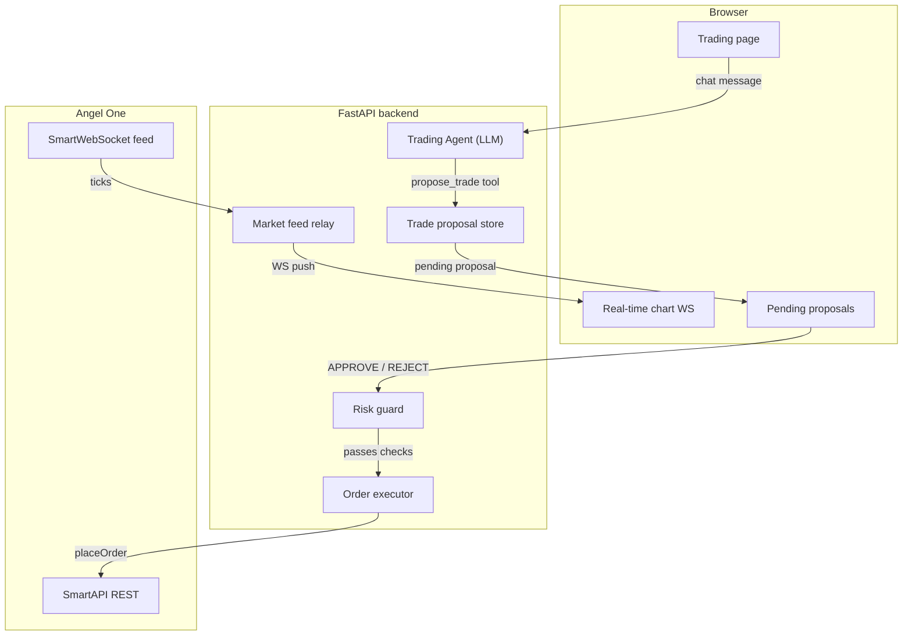
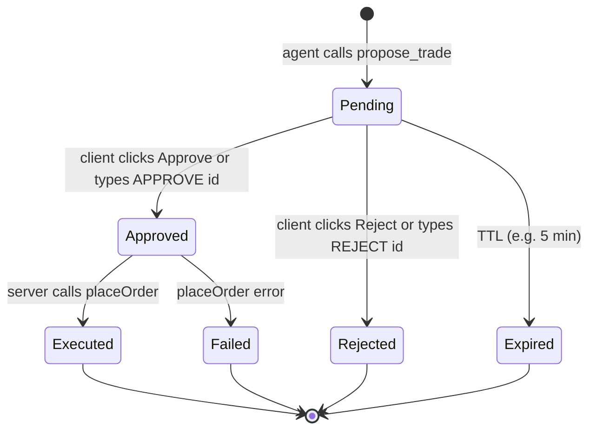

# Separate Trading Agent with Real-time Data and Permission-Gated Execution

## Current state (what exists)

- **One agent**: `agents/finance/` — a research + portfolio assistant that also has `angel_place_order` (direct execution, only soft "ask user" in prompt).
- **Agent infra**: [`agents/factory.py`](agents/factory.py) builds `LlmAgent` via OpenRouter/LiteLLM. [`services/adk_runner_registry.py`](services/adk_runner_registry.py) caches one `InMemoryRunner` per web `sid`, hard-wired to `build_finance_root_agent`.
- **Market data**: REST only — [`fetch_stock_history_candles`](services/broker_service.py) (historical OHLC), [`get_ltp`](angel_client.py) (snapshot), [`fetch_market_depth`](services/broker_service.py) (full quote).
- **No streaming**: `websocket-client` is in [`requirements.txt`](requirements.txt) but unused. The installed `smartapi-python` exposes `SmartWebSocket` (connects to `wss://wsfeeds.angelbroking.com/...`, subscribes via `mw`/`sfi`/`dp` tasks with `feedToken`), but [`angel_client.py`](angel_client.py) never stores or exposes the `feedToken` from `generateSession`.
- **User profile idea** already sketched in [`.env`](.env) notes: `{ age, goal, horizon_years, risk_tolerance, tax_bracket }`.

## What we are building

A **second, independent agent** (`agents/trading/`) that:
- Only proposes trades; **never fires orders** by itself.
- Uses the client's risk profile to decide what/how much to propose.
- Feeds a real-time price chart so both the agent and the user see live data.
- Requires explicit client approval (web button **or** chat `APPROVE <id>`) before execution hits Angel One.



---

## Part 1: Real-time market data pipeline

### 1a. Expose `feedToken` from Angel session

[`angel_client.py`](angel_client.py) — `_authenticate()` calls `self.smart_api.generateSession(...)` which returns `feedToken` in the response but the code discards it. Store it:

```python
# angel_client.py  (in _authenticate, after successful login)
self._feed_token = data["data"].get("feedToken")
self._client_code = self.client_id

@property
def feed_token(self) -> str | None:
    return getattr(self, "_feed_token", None)
```

### 1b. New service: `services/realtime_feed.py`

Wraps Angel's `SmartWebSocket` in a long-lived background thread per Angel session. API shape:

- `start_feed(client: AngelOneClient)` — connects once, auto-heartbeat.
- `subscribe(symbol_tokens: list[str], callback)` — calls `ws.subscribe("mw", token_channel)`.
- `on_tick(callback)` — fans out raw tick dicts.
- `stop_feed()` — clean shutdown.

Tick messages arrive as binary frames from Angel; decode per SmartAPI docs (struct-based binary for V1, or JSON for V2 if the package is upgraded). Normalize each tick to:

```python
{"symbol_token": str, "ltp": float, "volume": int, "ts": float, "bid": float, "ask": float}
```

### 1c. FastAPI WebSocket endpoint for browser

In [`web_app.py`](web_app.py) add:

```
WS /ws/market/{symbol}
```

On connect: resolve `symbol` -> `symboltoken` via `search_scrip`; register this browser client in the feed relay; push normalized ticks as JSON frames. On disconnect: unregister; if no subscribers remain for a token, unsubscribe from Angel WS.

**Fallback** (if WebSocket feed fails or user has no market data entitlement): poll `get_ltp` every 2-3s server-side and push via the same WS route so the frontend code path is identical.

### 1d. Frontend chart

Extend [`frontend/static/js/charts/candlestick.js`](frontend/static/js/charts/candlestick.js) (ECharts-based) or create a sibling `realtime-price.js`:

- On page load: fetch historical candles via existing `/api/research/technicals` or a new lightweight candle endpoint.
- Open `ws://host/ws/market/SYMBOL` and on each tick update the last candle's close / append a new candle if the minute rolled over.
- Show LTP, bid/ask, day change overlay.

---

## Part 2: Client risk profile

### 2a. Data model

Store per-session (keyed by web `sid`). Start in-memory; same lifecycle as `SessionManager`:

```python
@dataclass
class ClientRiskProfile:
    age: int
    goal: str                      # "wealth creation", "income", "preservation"
    horizon_years: int
    risk_tolerance: str            # "low", "medium", "high"
    tax_bracket: str
    max_single_order_value: float  # derived or explicit
    max_position_pct: float        # max % of portfolio in one stock
    allowed_products: list[str]    # ["DELIVERY"], or ["DELIVERY","INTRADAY"]
    max_daily_trades: int
```

### 2b. Collection endpoint

`POST /api/trading/profile` — the trading page shows a short form on first visit (or fetches from session if already set). The trading agent's instruction tells it to refuse proposals until a profile is loaded.

---

## Part 3: Trade proposal store (`services/trade_proposals.py`)

### 3a. Proposal lifecycle



### 3b. Storage shape

```python
@dataclass
class TradeProposal:
    proposal_id: str               # short UUID
    session_id: str                # web sid (owner)
    created_at: float
    ttl_seconds: int               # default 300
    status: str                    # pending | approved | rejected | expired | executed | failed

    # Order details (exactly what will go to Angel placeOrder)
    order_params: dict             # variety, tradingsymbol, symboltoken, transactiontype, exchange, ordertype, producttype, quantity, price, triggerprice, duration

    # Human-readable summary the agent shows
    summary: str                   # e.g. "BUY 10 RELIANCE @ market (~2,450) DELIVERY"

    # Post-execution
    order_id: str | None
    error: str | None
```

In-memory `dict[str, TradeProposal]` with a periodic sweep for expired entries (piggyback on the existing `_cleanup_loop` in [`main.py`](main.py)).

### 3c. Execution function (server-only, never an LLM tool)

```python
def execute_proposal(session_id: str, proposal_id: str) -> dict:
    proposal = store.get(proposal_id)
    assert proposal.session_id == session_id   # ownership
    assert proposal.status == "approved"
    assert not proposal.is_expired()

    # Risk checks
    profile = get_risk_profile(session_id)
    validate_against_profile(proposal.order_params, profile)  # raises on violation

    result = place_order_result(client, proposal.order_params)
    proposal.status = "executed" if result["ok"] else "failed"
    proposal.order_id = result.get("order_id")
    proposal.error = result.get("error")
    return result
```

---

## Part 4: The trading agent (`agents/trading/`)

### 4a. Package structure (mirrors `agents/finance/`)

```
agents/trading/
  __init__.py          # sys.path fix (same as finance)
  agent.py             # build_trading_root_agent, TRADING_INSTRUCTION
  tools.py             # trading-specific tool callables
  run.py               # CLI runner (optional, for testing)
  __main__.py          # python -m agents.trading.run
```

### 4b. Tools (in `agents/trading/tools.py`)

The agent gets **these tools only** — deliberately no `place_order`:

| Tool | Purpose |
|------|---------|
| `trading_get_risk_profile` | Read the client's stored risk profile so the agent knows constraints |
| `trading_get_ltp` | Current price for a symbol (thin wrapper on existing `get_ltp`) |
| `trading_get_market_depth` | Bid/ask depth (reuses [`fetch_market_depth`](services/broker_service.py)) |
| `trading_get_positions` | Open positions (reuses existing broker call) |
| `trading_get_holdings` | Demat holdings (reuses existing) |
| `trading_get_funds` | Available margin/cash |
| `trading_get_stock_history` | Recent OHLC candles (reuses [`fetch_stock_history_candles`](services/broker_service.py)) |
| `trading_propose_order` | **Core tool** — validates basic params, writes a `TradeProposal(status=pending)` to the store, returns `proposal_id` + human summary. Does NOT execute. |
| `trading_list_pending_proposals` | Show the user their current pending proposals and statuses |
| `trading_get_technicals` | RSI/MACD/MA (reuses [`compute_technical_indicators`](services/technical_service.py)) |
| `trading_search_scrip` | Symbol resolution (reuses existing `search_scrip`) |

### 4c. Agent instruction (`TRADING_INSTRUCTION`)

Key directives (abbreviated):

- "You are a **trading assistant**. You analyze prices, technicals, and the client's risk profile, then **propose** trades via `trading_propose_order`. You NEVER execute orders directly."
- "After proposing, tell the user the `proposal_id` and summary. Instruct them to click **Approve** in the UI or type `APPROVE <proposal_id>` in chat."
- "Respect the risk profile: do not propose an order exceeding `max_single_order_value`, or that would push a position above `max_position_pct`."
- "If no risk profile is loaded, ask the user to fill it in before proposing any trade."
- "Use `trading_get_ltp`, `trading_get_market_depth`, and `trading_get_technicals` to build your analysis before proposing."

### 4d. Build function

```python
def build_trading_root_agent(angel_session_id, *, model=None, api_key=None) -> LlmAgent:
    # same bootstrap pattern as finance agent
    tools = make_trading_tools(angel_session_id)
    return build_llm_agent(
        name="trading_agent",
        instruction=TRADING_INSTRUCTION,
        tools=tools,
        model=model, api_key=api_key,
        description="Risk-aware trading assistant with proposal-based execution.",
    )
```

---

## Part 5: Generalize the runner registry

[`services/adk_runner_registry.py`](services/adk_runner_registry.py) is currently hard-coded to `build_finance_root_agent`. Generalize:

- Accept an `agent_type: str` parameter (`"finance"` or `"trading"`).
- Cache runners as `dict[(angel_sid, agent_type), InMemoryRunner]`.
- Route to `build_finance_root_agent` or `build_trading_root_agent` based on `agent_type`.

`web_app.py` chat endpoint gets an optional `agent_type` field in the JSON body (default `"finance"` for backward compat).

---

## Part 6: Web routes and UI

### 6a. New API routes in [`web_app.py`](web_app.py)

- `POST /api/trading/profile` — save risk profile for this session.
- `GET  /api/trading/profile` — fetch current profile.
- `GET  /api/trading/proposals` — list proposals for this session.
- `POST /api/trading/proposals/{id}/approve` — set status to `approved`, run `execute_proposal`.
- `POST /api/trading/proposals/{id}/reject` — set status to `rejected`.
- `WS   /ws/market/{symbol}` — real-time tick stream (Part 1c).

### 6b. Chat APPROVE parsing

In the existing `POST /api/agent/chat` handler (or a pre-processing step), if the message matches `APPROVE <proposal_id>` or `REJECT <proposal_id>`:
- Execute the approval/rejection server-side **before** forwarding to the LLM.
- Prepend the result to the agent context so it can confirm to the user.

This is **trusted server code** — the LLM cannot forge approvals.

### 6c. New template: `frontend/templates/trading.html`

- **Risk profile form** (top, collapsible once set).
- **Real-time chart panel** — symbol picker, ECharts canvas wired to `/ws/market/{symbol}`.
- **Chat panel** — same pattern as `agent.html` but posts to `/api/agent/chat` with `agent_type: "trading"`.
- **Pending proposals panel** — polls `/api/trading/proposals` or receives updates via the chat response; Approve / Reject buttons.

---

## Part 7: Keep existing finance agent untouched

The finance agent keeps all its current tools (including `angel_place_order` for now — that is a separate cleanup decision). The trading agent is a **parallel** agent with its own page, chat thread, and tool set. Users pick which agent to talk to via navigation.

---

## Files to create / modify

**New files:**
- `agents/trading/__init__.py`
- `agents/trading/agent.py`
- `agents/trading/tools.py`
- `agents/trading/run.py` (optional CLI)
- `agents/trading/__main__.py`
- `services/trade_proposals.py`
- `services/realtime_feed.py`
- `services/risk_profile.py`
- `frontend/templates/trading.html`
- `frontend/static/js/trading.js`
- `frontend/static/js/charts/realtime-price.js`

**Modified files:**
- [`angel_client.py`](angel_client.py) — expose `feed_token` property.
- [`services/adk_runner_registry.py`](services/adk_runner_registry.py) — generalize for multiple agent types.
- [`web_app.py`](web_app.py) — new routes (trading profile, proposals, WS market, chat `agent_type` param, APPROVE parsing).
- [`main.py`](main.py) — proposal cleanup in the existing periodic loop.
- [`frontend/templates/base.html`](frontend/templates/base.html) — add "Trading" nav link.

**Not modified:**
- `agents/finance/*` — left as-is.
- `mcp_server.py` — separate concern; can add proposal flow later.
