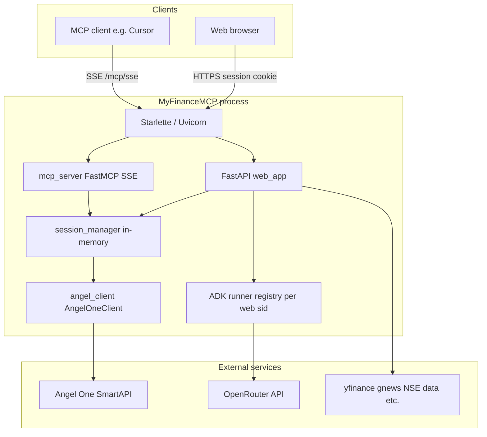

# MyFinanceMCP — Angel One Portfolio Tracker

A multi-user MCP server and web dashboard for tracking your Angel One portfolio, positions, orders, and P&L in real time.

## Features

- **MCP Server (SSE transport)** — connect from Cursor, Claude Desktop, or any MCP-compatible client
- **Web Dashboard** — browser-based portfolio viewer with login, holdings, positions, and orders pages
- **Finance ADK agent (web)** — after login, open **Agent** in the nav to chat with the Google ADK finance assistant (Angel One + research tools). Use **New conversation** to reset the chat thread. Requires `OPENROUTER_API_KEY` on the **server** (see below)
- **Multi-user** — each user authenticates with their own Angel One credentials
- **Zero credential storage** — credentials live only in server memory for the session duration (max 8 hours)

## Project Structure

```
├── main.py              # Combined entry point (MCP + Web on one port)
├── mcp_server.py        # MCP FastMCP app (tools: login, portfolio, trading)
├── web_app.py           # FastAPI web dashboard
├── angel_client.py      # Angel One SmartAPI client wrapper
├── session_manager.py   # Per-session client management
├── services/            # Domain logic (AI, fundamentals, technicals, sectors, sentiment)
├── frontend/            # Jinja2 templates and static assets (CSS, JS)
├── data/                # JSON data files served under /static/data
├── requirements.txt     # Python dependencies
├── Dockerfile           # Container definition
└── .dockerignore
```

## Architecture

One process ([`main.py`](main.py)) mounts the MCP app under `/mcp` and the FastAPI web app at `/` (same Uvicorn port).



### Request paths

| Path | Purpose |
|------|--------|
| `/`, `/dashboard`, `/agent`, … | Jinja pages + static assets |
| `/api/*` | JSON for dashboard, news, research, `/api/agent/chat`, `/api/agent/new-chat`, `/api/ai/*` |
| `/mcp/...` | MCP over SSE (`login`, holdings, orders, etc.) |

### Session flows

- **Web login:** Browser posts Angel credentials → server creates an `AngelOneClient` in memory and stores an opaque **`sid`** in a signed session cookie. The **Agent** page also stores **`adk_chat_session_id`** in that cookie for multi-turn ADK chat.
- **MCP:** The client calls the `login` tool; the server stores the Angel session under a key derived from the **MCP connection** (`id(ctx.session)` in [`mcp_server.py`](mcp_server.py)). That key is **not** the same as the browser `sid`, so web and MCP logins are separate unless you bridge them yourself.

## Getting Your Angel One API Credentials

You need 4 credentials to use MyFinanceMCP. Generate them from the **Angel One SmartAPI** portal:

**[https://smartapi.angelbroking.com/signin](https://smartapi.angelbroking.com/signin)**

| Credential | How to get it |
|---|---|
| **API Key** | Sign in to SmartAPI → My Apps → Create App → copy the API Key |
| **Client ID** | Your Angel One account ID (e.g. `AB1234`) — visible on the SmartAPI dashboard or your Angel One app |
| **PIN** | The 4-digit trading PIN you use to log into Angel One |
| **TOTP Secret** | SmartAPI → My Profile → Enable TOTP → copy the Base32 secret key |

> **Note:** The TOTP secret is only shown once when you enable it. Save it immediately.

## Run Locally

### 1. Create a virtual environment

```bash
python3 -m venv .venv
source .venv/bin/activate        # macOS / Linux
# .venv\Scripts\activate         # Windows
```

### 2. Install dependencies

```bash
pip install -r requirements.txt
```

### 3. Configure environment variables

Copy the example file and fill in your Angel One credentials:

```bash
cp .env.example .env
```

Edit `.env` with your values (see [Getting Your Angel One API Credentials](#getting-your-angel-one-api-credentials) above).

For the **Agent** page (`/agent`), also set **`OPENROUTER_API_KEY`** in `.env` (or the process environment). That key is read on the server by the ADK agent (LiteLLM → OpenRouter). It is **not** the same as the optional OpenRouter key you can store in the browser for **Dashboard → AI insights / Ask AI** (`/api/ai/*`), which is sent per request from the client.

**Scaling note:** The ADK integration uses in-memory runners and sessions in the same process as the web app. Use a **single** uvicorn worker (the default for `python main.py`) so chat state and Angel sessions stay consistent. Multiple workers without sticky sessions will not share that state.

### 4. Start the server

```bash
python main.py
```

The server starts on `http://localhost:8000`:
- Web dashboard: `http://localhost:8000/`
- MCP SSE endpoint: `http://localhost:8000/mcp/sse`

## Connect from an MCP Client

### Cursor

Add to your `.cursor/mcp.json`:

```json
{
  "mcpServers": {
    "angelone-portfolio": {
      "url": "http://localhost:8000/mcp/sse"
    }
  }
}
```

Then call the `login` tool with your Angel One credentials to start a session.

### Claude Desktop

Add to your `claude_desktop_config.json`:

```json
{
  "mcpServers": {
    "angelone-portfolio": {
      "command": "npx",
      "args": ["-y", "mcp-remote", "http://localhost:8000/mcp/sse"]
    }
  }
}
```

### ChatGPT Desktop

In ChatGPT Desktop, go to **Settings → Beta features → MCP Servers → Add Server** and enter:
- **Command:** `npx`
- **Arguments:** `-y mcp-remote http://localhost:8000/mcp/sse`

## Deploy to Railway (Recommended)

1. Push this repo to GitHub
2. Go to [railway.app](https://railway.app) and create a new project
3. Connect your GitHub repository
4. Railway auto-detects the Dockerfile and deploys
5. Set the environment variable `PORT=8000` (Railway usually injects this automatically)
6. Get your public URL (e.g. `https://myfinancemcp.up.railway.app`)

### After Deployment

**Web users:** Visit `https://your-app.up.railway.app` and log in with Angel One credentials.

**MCP users:** Update the `url` in your MCP client config:

```json
{
  "mcpServers": {
    "angelone-portfolio": {
      "url": "https://your-app.up.railway.app/mcp/sse"
    }
  }
}
```

## Deploy to Render (Free Tier)

1. Push to GitHub
2. Go to [render.com](https://render.com), create a new **Web Service**
3. Connect your repo, select **Docker** as the runtime
4. Set environment variable `PORT=8000`
5. Deploy

## Available MCP Tools

| Tool | Description |
|---|---|
| `login` | Authenticate with Angel One (must call first) |
| `logout` | Discard session credentials |
| `get_profile` | Account profile |
| `get_holdings` | Stock holdings with P&L |
| `get_all_holdings` | Complete holdings overview |
| `get_positions` | Open positions |
| `get_order_book` | Today's orders |
| `get_trade_book` | Executed trades |
| `get_funds` | Account funds / margin |
| `get_ltp` | Last traded price |
| `search_scrip` | Search stocks by name |
| `portfolio_summary` | High-level portfolio summary |
| `get_candle_data` | Historical OHLC data |
| `place_order` | Place a new order |
| `modify_order` | Modify an existing order |
| `cancel_order` | Cancel an order |

## Security

### What lives where

| Location | What is stored | Notes |
|----------|----------------|--------|
| **Server memory** | Angel API key, PIN, TOTP secret, and active `AngelOneClient` (tokens), keyed by web `sid` or MCP connection id | **Not** written to an app database; cleared on logout, session expiry (~8 hours), or process restart ([`session_manager.py`](session_manager.py)). |
| **Server `.env` / host env** | `ANGELONE_*` (optional bootstrap for ADK CLI), **`OPENROUTER_API_KEY`**, optional `SESSION_SECRET`, news keys, etc. | **On disk** wherever you deploy config—protect the host and your secrets manager. |
| **Signed session cookie** | Opaque **`sid`** (web Angel session), **`adk_chat_session_id`** (ADK thread id) | Signed with **`SESSION_SECRET`** ([`web_app.py`](web_app.py)). If `SESSION_SECRET` is unset, a random key is generated on each process start (existing cookies stop working). Use **HTTPS** in production. |
| **Server memory (ADK)** | `InMemoryRunner` and ADK session/event state per logged-in user | Same process as the web app; lost on restart. Prefer a **single** Uvicorn worker so this state is not split across processes. |
| **Browser `localStorage`** | **Optional** encrypted (AES-GCM) or XOR-stored OpenRouter key for **Dashboard → AI insights / Ask AI** only; chosen model id | **Not** used by **`/agent`** ADK chat (the server uses `OPENROUTER_API_KEY`). Derivation uses **client id** as key material—device access can still expose it. |
| **Browser (typical)** | No Angel credentials after login | Credentials are sent once over HTTPS at login; the session cookie identifies the server-side session. |

### Practices reflected in the app

- Angel credentials are **not** persisted by the application in a database; they live in **RAM** for the session lifetime.
- Web-backed Angel sessions **expire** after 8 hours (`SESSION_TTL_SECONDS` in [`session_manager.py`](session_manager.py)).
- Terminate **TLS** at the edge for public deployments (Railway, Render, etc.).
- **MCP** and **web** share one `SessionManager` but **different** session keys, so an MCP `login` does not automatically attach to a browser session.

### Operational cautions

- Lock down **`.env`** (file permissions, no commits) and use platform secret stores in production.
- **Dashboard “Save OpenRouter key”** keeps ciphertext in **localStorage** on that browser—treat the device as trusted.
- Provider **rate limits** (Angel, OpenRouter, news APIs) still apply; heavy polling can trigger throttling.

## License

MIT
