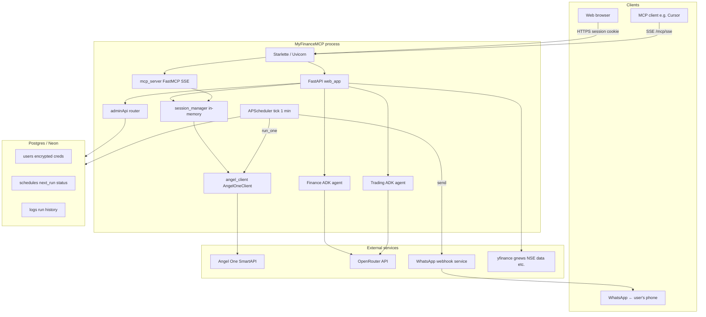

# MyFinanceMCP — Angel One Portfolio Tracker

A multi-user MCP server and web dashboard for tracking your Angel One portfolio, with AI-powered daily briefings, a trading agent, and ML-based price predictions.

## Features

- **MCP Server (SSE transport)** — connect from Cursor, Claude Desktop, or any MCP-compatible client
- **Web Dashboard** — browser-based portfolio viewer with login, holdings, positions, orders, and P&L pages
- **Finance ADK Agent** — chat with the Google ADK finance assistant (Angel One + research tools) via the **Agent** tab. Requires `OPENROUTER_API_KEY` on the server
- **Trading ADK Agent** — risk-aware, proposal-based order execution agent. Analyses prices and technicals; proposes trades but never places orders without explicit approval
- **Daily Briefing Scheduler** — automatically sends a WhatsApp message each day with per-stock signals (green/yellow/red), LightGBM predictions, and an LLM-written summary of your portfolio
- **ML Price Prediction** — LightGBM model predicts price direction across 7 timeframes (10 min → 1 year) using technical indicators, price-action features, and sentiment
- **Admin API** — REST endpoints (`/api/admin/*`) for registering premium users with Fernet-encrypted Angel credentials and managing their schedules
- **Multi-user** — each session authenticates with its own Angel One credentials; premium users' credentials are stored encrypted in Postgres
- **Zero plaintext credential storage** — transient sessions live only in RAM; premium user credentials are encrypted at rest with a Fernet key

## Project Structure

```
├── main.py                      # Combined entry point (MCP + Web on one port)
├── mcp_server.py                # MCP FastMCP app (tools: login, portfolio, trading)
├── web_app.py                   # FastAPI web dashboard + briefing schedule API
├── angel_client.py              # Angel One SmartAPI client wrapper
├── session_manager.py           # Per-session client management (in-memory)
│
├── db/                          # Postgres layer (SQLModel + Neon)
│   ├── engine.py                #   Engine, init_db, additive column migrations
│   ├── models.py                #   User, Schedule, Log tables
│   ├── crypto.py                #   Fernet encrypt/decrypt for stored credentials
│   └── __init__.py
│
├── adminApi/                    # Admin REST API (X-Admin-Key protected)
│   ├── router.py                #   /api/admin/users, /api/admin/schedules, /api/admin/logs
│   └── __init__.py
│
├── agents/                      # Google ADK agents
│   ├── factory.py               #   LlmAgent builder (OpenRouter via LiteLLM)
│   ├── finance/                 #   Finance research agent
│   └── trading/                 #   Proposal-based trading agent
│
├── services/                    # Domain logic
│   ├── schedular/               #   Scheduler pipeline
│   │   ├── runner.py            #     APScheduler tick (every 1 min)
│   │   ├── repository.py        #     DB claim / finish (FOR UPDATE SKIP LOCKED)
│   │   ├── job_executor.py      #     Per-schedule pipeline (session → briefing → WhatsApp)
│   │   ├── daily_briefing.py    #     LLM briefing generation (holdings + candles + LightGBM)
│   │   └── whatsapp.py          #     WhatsApp delivery via webhook
│   ├── prediction_service.py    #   LightGBM price-direction predictions
│   ├── ai_service.py            #   OpenRouter AI helpers
│   ├── technical_service.py     #   RSI, MACD, Bollinger, SMA, volume signals
│   ├── fundamental_service.py   #   Fundamental data
│   ├── sentiment_service.py     #   News sentiment scoring
│   ├── sector_service.py        #   Sectoral analysis
│   ├── news_service.py          #   News fetching
│   ├── risk_profile.py          #   User risk profile
│   ├── trade_proposals.py       #   In-memory proposal store for trading agent
│   └── realtime_feed.py         #   Real-time price feed
│
├── integrations/                # Adapters bridging sessions ↔ MCP / local accounts
├── models/                      # LightGBM model training scripts
├── frontend/                    # Jinja2 templates and static assets (CSS, JS)
├── data/                        # JSON data files served under /static/data
├── requirements.txt             # Python dependencies
├── Dockerfile                   # Container definition
└── .env.example                 # Environment variable template
```

## Architecture

One process ([`main.py`](main.py)) mounts the MCP app under `/mcp` and the FastAPI web app at `/` on a single Uvicorn port. The scheduler runs inside the same process (APScheduler async) when `SCHEDULER_ENABLED=1`.



### Request paths

| Path | Purpose |
|------|--------|
| `/`, `/dashboard`, `/agent`, … | Jinja pages + static assets |
| `/api/*` | JSON for dashboard, news, research, `/api/agent/chat`, `/api/agent/new-chat`, `/api/ai/*` |
| `/mcp/...` | MCP over SSE (`login`, holdings, orders, etc.) |
| `/docs` | Swagger UI (FastAPI auto-generated) |

### Session flows

- **Web login:** Browser posts Angel credentials → server creates an `AngelOneClient` in memory and stores an opaque **`sid`** in a signed session cookie.
- **Daily briefing:** Scheduler ticks every minute → queries `schedules` for rows where `next_run <= now()` → claims them with `FOR UPDATE SKIP LOCKED` → for each claimed schedule: decrypts credentials from `users`, creates an ephemeral Angel session, generates the briefing, sends WhatsApp, writes to `logs`, and arms `next_run`.
- **MCP:** Client calls the `login` tool; session stored under a key derived from the MCP connection (`id(ctx.session)`). Web and MCP logins are separate unless bridged explicitly.

## Getting Your Angel One API Credentials

You need 4 credentials from the **Angel One SmartAPI** portal:

**[https://smartapi.angelbroking.com/signin](https://smartapi.angelbroking.com/signin)**

| Credential | How to get it |
|---|---|
| **API Key** | SmartAPI → My Apps → Create App → copy the API Key |
| **Client ID** | Your Angel One account ID (e.g. `AB1234`) — visible on the SmartAPI dashboard |
| **PIN** | The 4-digit trading PIN you use to log into Angel One |
| **TOTP Secret** | SmartAPI → My Profile → Enable TOTP → copy the Base32 secret key |

> **Note:** The TOTP secret is only shown once when you enable it. Save it immediately.

## Run Locally

### 1. Create a virtual environment

```bash
python3 -m venv .venv
source .venv/bin/activate        # macOS / Linux
# .venv\Scripts\activate         # Windows
```

### 2. Install dependencies

```bash
pip install -r requirements.txt
```

### 3. Set up Postgres

The scheduler and admin API require a Postgres database. The easiest option for development is a free [Neon](https://neon.tech) database. Tables are created automatically on first startup via `init_db()`.

### 4. Configure environment variables

```bash
cp .env.example .env
```

Edit `.env` with your values:

| Variable | Required | Description |
|---|---|---|
| `ANGELONE_API_KEY` | For ADK CLI only | Bootstrap credentials for local ADK agent testing |
| `ANGELONE_CLIENT_ID` | For ADK CLI only | See above |
| `ANGELONE_PASSWORD` | For ADK CLI only | See above |
| `ANGELONE_TOTP_SECRET` | For ADK CLI only | See above |
| `OPENROUTER_API_KEY` | Yes (for Agent/Trading/Briefing) | Server-side LLM key |
| `DATABASE_URL` | Yes | Postgres connection string (e.g. Neon pooler URL with `?sslmode=require`) |
| `ENCRYPTION_KEY` | Yes | Fernet key for encrypting Angel credentials in DB. Generate with: `python -m db.crypto generate` |
| `ADMIN_API_KEY` | Yes | Static key protecting all `/api/admin/*` endpoints |
| `SCHEDULER_ENABLED` | Yes (for briefings) | Set to `1` to start the APScheduler tick on process startup |
| `SESSION_SECRET` | Recommended | Signs session cookies. Random key generated on each restart if unset (invalidates existing cookies) |

> **Note on two OpenRouter keys:** The server `OPENROUTER_API_KEY` is used by the ADK agents and the daily briefing pipeline. There is a separate *optional* per-browser OpenRouter key for **Dashboard → AI Insights / Ask AI** (`/api/ai/*`) — that is stored only in the browser and never sent to the server's env.

**Scaling note:** The ADK integration uses in-memory runners in the same process. Use a **single** Uvicorn worker (the default with `python main.py`) so chat state and Angel sessions stay consistent.

### 5. Start the server

```bash
python main.py
```

The server starts on `http://localhost:8000`:
- Web dashboard: `http://localhost:8000/`
- Swagger UI: `http://localhost:8000/docs`
- MCP SSE endpoint: `http://localhost:8000/mcp/sse`

## Daily Briefing Scheduler

The scheduler sends a personalised WhatsApp message to each premium user at their configured time each day. The message includes:
- Per-stock signals (🟢 / 🟡 / 🔴) with price and % changes
- LightGBM 1-day and 1-week direction predictions
- An LLM-written portfolio summary via OpenRouter

### How to set it up

1. **Create a user** via the Admin API (see below).
2. **Set a schedule** — log in as that user and go to the **Trading** tab → **Daily Briefing**, or call `POST /api/briefing/schedule` with `{"time_ist": "08:30"}`.
3. **Ensure `SCHEDULER_ENABLED=1`** in your environment and restart.

### How it works internally

```
APScheduler tick (every 1 min)
  └── repository.claim_due_schedules()   ← SQL: next_run <= now(), FOR UPDATE SKIP LOCKED
        └── job_executor.run_one(claim)
              ├── Load user + decrypt credentials (Fernet)
              ├── Create ephemeral Angel session
              ├── generate_daily_briefing()  ← holdings + candles + LightGBM + LLM
              ├── whatsapp.send()            ← POST to webhook service
              ├── Write Log row
              └── finish_schedule()          ← advance next_run by interval_minutes
```

## Admin API

All endpoints require the `X-Admin-Key: <your ADMIN_API_KEY>` header. Browse to `/docs` for interactive Swagger UI.

| Endpoint | Method | Description |
|---|---|---|
| `/api/admin/users` | GET | List all registered users |
| `/api/admin/users` | POST | Create a user (encrypts password + TOTP before storing) |
| `/api/admin/users/{id}` | GET | Get a single user |
| `/api/admin/users/{id}` | DELETE | Deactivate a user |
| `/api/admin/schedules` | GET | List all schedules |
| `/api/admin/schedules` | POST | Create a schedule for a user |
| `/api/admin/schedules/{id}` | GET | Get a single schedule |
| `/api/admin/schedules/{id}` | PATCH | Update schedule (enable/disable, interval, next_run) |
| `/api/admin/schedules/{id}` | DELETE | Delete a schedule |
| `/api/admin/logs` | GET | Recent scheduler run logs (filterable by user_id) |

### Example: register a user

```bash
curl -X POST http://localhost:8000/api/admin/users \
  -H "X-Admin-Key: admin123" \
  -H "Content-Type: application/json" \
  -d '{
    "whatsapp_number": "918107037133",
    "angel_api_key": "Z0hsKZYf",
    "angel_client_id": "PPSU16696",
    "angel_password": "8107",
    "angel_totp_secret": "FP4O3EVUYXZ5Q3WTF6I7JR772Y"
  }'
```

## Connect from an MCP Client

### Cursor

Add to your `.cursor/mcp.json`:

```json
{
  "mcpServers": {
    "angelone-portfolio": {
      "url": "http://localhost:8000/mcp/sse"
    }
  }
}
```

Then call the `login` tool with your Angel One credentials to start a session.

### Claude Desktop

Add to your `claude_desktop_config.json`:

```json
{
  "mcpServers": {
    "angelone-portfolio": {
      "command": "npx",
      "args": ["-y", "mcp-remote", "http://localhost:8000/mcp/sse"]
    }
  }
}
```

### ChatGPT Desktop

Go to **Settings → Beta features → MCP Servers → Add Server** and enter:
- **Command:** `npx`
- **Arguments:** `-y mcp-remote http://localhost:8000/mcp/sse`

## Available MCP Tools

| Tool | Description |
|---|---|
| `login` | Authenticate with Angel One (must call first) |
| `logout` | Discard session credentials |
| `get_profile` | Account profile |
| `get_holdings` | Stock holdings with P&L |
| `get_all_holdings` | Complete holdings overview |
| `get_positions` | Open positions |
| `get_order_book` | Today's orders |
| `get_trade_book` | Executed trades |
| `get_funds` | Account funds / margin |
| `get_ltp` | Last traded price |
| `search_scrip` | Search stocks by name |
| `portfolio_summary` | High-level portfolio summary |
| `get_candle_data` | Historical OHLC data |
| `place_order` | Place a new order |
| `modify_order` | Modify an existing order |
| `cancel_order` | Cancel an order |

## Deploy to Railway (Recommended)

1. Push this repo to GitHub
2. Go to [railway.app](https://railway.app) and create a new project
3. Connect your GitHub repository
4. Railway auto-detects the Dockerfile and deploys
5. Set the following environment variables in Railway:
   - `DATABASE_URL` (Postgres connection string)
   - `ENCRYPTION_KEY`
   - `ADMIN_API_KEY`
   - `OPENROUTER_API_KEY`
   - `SCHEDULER_ENABLED=1`
   - `SESSION_SECRET`
6. Get your public URL (e.g. `https://myfinancemcp.up.railway.app`)

### After Deployment

**Web users:** Visit `https://your-app.up.railway.app` and log in with Angel One credentials.

**MCP users:** Update the `url` in your MCP client config:

```json
{
  "mcpServers": {
    "angelone-portfolio": {
      "url": "https://your-app.up.railway.app/mcp/sse"
    }
  }
}
```

## Deploy to Render (Free Tier)

1. Push to GitHub
2. Go to [render.com](https://render.com), create a new **Web Service**
3. Connect your repo, select **Docker** as the runtime
4. Set all required environment variables (same list as Railway above)
5. Deploy

> **Note:** Render free tier spins down after inactivity. The scheduler resumes when the service wakes up, but will immediately fire all overdue schedules on the next tick.

## Security

### What lives where

| Location | What is stored | Notes |
|----------|----------------|--------|
| **Server memory** | Transient `AngelOneClient` instances keyed by web `sid` or MCP connection id | Not written to DB; cleared on logout, session expiry (~8 hours), or process restart |
| **Postgres DB** | Premium `users` rows with `angel_password_encrypted` and `angel_totp_secret_encrypted` | Encrypted with Fernet (`ENCRYPTION_KEY`). Never returned in plaintext by any API response |
| **Server `.env` / host env** | `OPENROUTER_API_KEY`, `ENCRYPTION_KEY`, `ADMIN_API_KEY`, `DATABASE_URL`, `SESSION_SECRET` | Protect the host and use a secrets manager in production |
| **Signed session cookie** | Opaque `sid` (web Angel session), `adk_chat_session_id` (ADK thread) | Signed with `SESSION_SECRET`. Use HTTPS in production |
| **Server memory (ADK)** | `InMemoryRunner` and ADK session/event state per logged-in user | Lost on restart. Use a single Uvicorn worker |
| **Browser `localStorage`** | Optional encrypted OpenRouter key for **Dashboard → AI Insights** only | Not used by `/agent` or scheduler. Encrypted with AES-GCM using client id as key material |
| **Browser (typical)** | No Angel credentials after login | Sent once over HTTPS at login; session cookie identifies the server-side session |

### Practices reflected in the app

- Transient Angel credentials are **never persisted** by the application; they live in RAM for the session lifetime.
- Stored premium credentials are **Fernet-encrypted** at rest; the raw values are only decrypted in the scheduler worker for the duration of a briefing run and then discarded.
- Web-backed Angel sessions **expire** after 8 hours (`SESSION_TTL_SECONDS` in [`session_manager.py`](session_manager.py)).
- The `FOR UPDATE SKIP LOCKED` pattern in `repository.py` makes the scheduler safe to run across multiple replicas, though only one process should have `SCHEDULER_ENABLED=1`.
- Terminate **TLS** at the edge for public deployments (Railway, Render, etc.).

### Operational cautions

- Lock down **`.env`** (file permissions, no commits) and use platform secret stores in production.
- **Dashboard "Save OpenRouter key"** keeps ciphertext in `localStorage` — treat the device as trusted.
- Provider **rate limits** (Angel, OpenRouter, news APIs) still apply; heavy polling can trigger throttling.
- The **TOTP secret** stored in the DB allows the scheduler to generate TOTP codes autonomously. Treat it with the same sensitivity as a password.

## License

MIT
